# Industrial Economics Study Guide

## 1. Introduction to Industrial Economics
* **Definition:** A branch of economics dealing with the economic problems of firms and industries and their relationship with society.
* **Origin:** The term "industrial economics" was adopted in the early 1950s through the writings of P.W.S. Andrews.
* **Microeconomics:** The study of individual economic units.
* **Macroeconomics:** The study of the economy as a whole.

---

## 2. Scarcity and Choice
* **Scarcity:** The condition where resources are not available in the required quantities to satisfy all wants and needs.
* **Origin of Definition:** The scarcity definition of Economics was established by Lionel Robbins.
* **The Need for Choice:** Due to scarcity, people are forced to make choices between different goods and services.
* **Human Wants:** Demands are unlimited and will never be completely satisfied; satisfying one desire leads to the creation of new ones.

**Classification of Resources:**
* Natural Resources
* Human Resources
* Capital Resources

> **Note on "Why in Engineering":** Applying these economic principles to engineering and technical fields is crucial for optimizing resource allocation, design choices, and project feasibility.

---

## 3. Basic Economic Units & Production
* **Economic Units:** The two basic units of an economy are Households and Firms.
* **Primary Activities:** Consumption and Production.

**Factors of Production:**
* **Land:** Includes surface soil and all natural resources.
* **Labour:** The physical and mental work contributed by people.
* **Capital:** All man-made aids to production (physical stock and machinery).
* **Entrepreneurship:** The ownership, organization, and control of the production process.

---

## 4. Economic Assumptions

### Behavioural Assumptions
* **The Rational Consumer:** Aims to maximize their satisfaction from a given money income and its expenditure on goods and services.
* **The Rational Producer:** Aims to maximize their financial profits.

### Ceteris Paribus Assumption
* **The Law of Demand:** The amount demanded increases with a fall in price and diminishes with a rise in price, *other things being equal*.
* **"Other Things":** This assumes there are no changes in consumer income, tastes, habits, or the prices of related goods.

---

## 5. The Three Fundamental Economic Problems
Every economy faces three basic problems due to resource scarcity:

### Problem 1: What to produce?
* **The Issue:** An economy cannot produce all desired goods because resources are limited. 
* **The Trade-off:** A choice must be made between different goods and services. Producing more of one item strictly means producing less of another.
* **Examples:** A farmer with a single plot of land deciding whether to grow rice or wheat; a factory deciding between manufacturing a solar cooker or a gas stove.

### Problem 2: How to produce?
* **The Issue:** Deciding on the specific technique of production to use.
* **Labour-Intensive Technique:** Relies heavily on human labour, which promotes job creation and employment.
* **Capital-Intensive Technique:** Relies heavily on machines and automation, which promotes efficiency and economic growth.
* **Examples:** Choosing between a manual handloom and a mechanical power loom; deciding between manual assembly and automated manufacturing of steel pipes.

### Problem 3: For whom to produce?
* **The Issue:** Dealing with the problem of distribution. Since an economy cannot satisfy everyone's wants, it must decide who receives the total output of goods and services.
* **The Mechanism:** This distribution is directly tied to the purchasing power of individuals within the economy.
* **Examples:** Distributing goods based on an individual's ability to pay versus a Public Distribution System (PDS); deciding whether to allocate resources to produce luxury goods or normal goods.

# Production Possibility Curve (PPC) Study Guide

## 1. Introduction & Definition
* **Definition:** A curve showing the various combinations of two goods that can be produced with given resources when they are fully and efficiently utilized.
* **Alternative Names:** Production Possibility Frontier (PPF) or Transformation Curve.

---

## 2. Core Assumptions
To construct a valid PPC model, the following economic assumptions must be made:
* **Two Goods Only:** The economy is simplified to produce only two commodities.
* **Constant Technology:** The economy is utilizing the latest available technology, and this technological level remains unchanged during the period analyzed.
* **Maximum Efficiency:** All available resources are being utilized fully and efficiently (no wasted resources).

---

## 3. Production Possibility Schedule
This hypothetical schedule maps the trade-off between producing "Machines" (in thousands) and "Wheat" (in lakh tonnes). 

| Possibility | Machines (Thousands) | Wheat (Lakh Tonnes) |
| :--- | :--- | :--- |
| **A** | 5 | 0 |
| **B** | 4 | 5 |
| **C** | 3 | 8 |
| **D** | 2 | 11 |
| **E** | 1 | 13 |
| **F** | 0 | 15 |

---

## 4. Features and Shape of the PPC
When graphing the schedule (Machines on the x-axis, Wheat on the y-axis), the curve displays distinct geometric features:

* **Downward Sloping:** Producing more of one good strictly requires sacrificing some quantity of the other good.
* **Concave Shape:** The curve bows outward (concave to the origin).
* **Increasing Marginal Opportunity Cost (MOC):** This explains the concave shape. To produce each *additional* unit of one good, the amount of the other good that must be sacrificed (the opportunity cost) goes up at an increasing rate.

---

## 5. Interpreting Points on the Graph

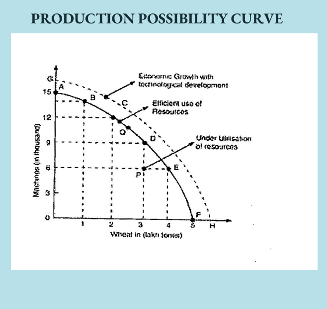
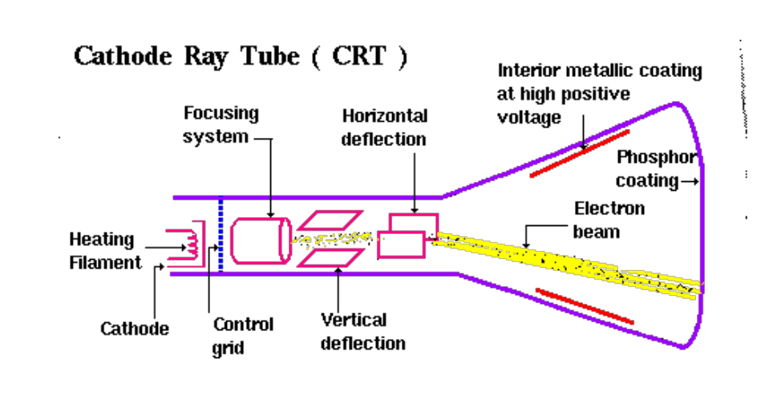
Understanding where a production point lies relative to the curve indicates the state of the economy:
* **On the Curve (e.g., Points B, C):** Represents the efficient and full utilization of all resources.
* **Below the Curve (e.g., Point H):** Indicates underutilization of resources or inefficiency (e.g., high unemployment).
* **Above/Beyond the Curve (e.g., Point L):** Represents an unattainable combination with current resources and technology. Reaching this point is currently impossible without economic growth.

---

## 6. Shifts in the PPC
The PPC is not permanently static. External economic factors can shift the entire boundary:
* **Original Baseline:** Represented by the baseline curve $PP$.
* **Outward Shift (Right to $P_1P_1'$):** Caused by **economic growth** or **technological advancement**. The economy can now produce more of both goods.
* **Inward Shift (Left to $P_2P_2'$):** Caused by a **loss or destruction of resources** (e.g., natural disasters, war). The economy's total productive capacity shrinks.

---

# Introduction to Firms: Study Guide

## 1. What is a Firm?
* **Definition:** A specialized organization devoted to managing the process of production.
* **Function:** It produces various goods and services by utilizing different factors of production:
  * Land
  * Labour
  * Capital
  * Organization / Entrepreneurship

---

## 2. Types of Firms & Their Advantages

### I. Sole Proprietorship (Sole Trader)
A business owned, managed, and controlled by a single individual. This owner holds all assets and is personally liable for all obligations and costs.
* **Advantages:**
  * **Low Barrier to Entry:** Requires low capital investment to start.
  * **Agility:** Allows for quick decision-making and highly flexible operations.
  * **Simplicity:** Involves very few legal formalities compared to other structures.

### II. Partnership Firms
A business owned by two or more individuals. There is no maximum limit to the number of partners. Partners jointly own the business assets and share liability for all business obligations.
* **Advantages:**
  * **Increased Capital:** Benefits from the availability of more resources compared to a sole proprietorship.
  * **Shared Burden:** The responsibility of making decisions is distributed among the partners.
  * **Structured Returns:** Profits are shared among partners according to a pre-agreed ratio.

### III. Joint Stock Company
A business organization owned by multiple individual stockholders. It possesses a **separate legal identity**, allowing the company to make investments and borrow money on its own behalf.
* **Types:**
  * **Private Limited Company:** Maximum of 50 shareholders.
  * **Public Limited Company:** No maximum limit on the number of members.
* **Advantages:**
  * **Independent Entity:** Considered a legal "person" capable of conducting business independently.
  * **Limited Liability:** The personal assets of the owners are protected; liability is limited to their investment.
  * **Professional Management:** While shareholders own the corporation, it is typically run by professional managers.

### IV. The Cooperative Society
Formed through a voluntary association of individuals who join together to promote member welfare. The main objective is to protect the economic interests of its members and prevent their exploitation.
* **Advantages:**
  * **Democratic Control:** Each member gets exactly one vote, regardless of their capital contribution.
  * **Limited Liability:** A member's liability is strictly limited to their individual capital contribution.
  * **Cost Efficiency:** Because the producers themselves are members, overall production costs can be minimized.

### V. Public Sector Undertakings (PSUs)
A company or organization that is owned by the government. It typically provides essential services (education, health, transportation) to improve public welfare.
* **Advantages:**
  * **Welfare Focus:** These organizations are not primarily guided by a profit motive.
  * **Job Creation:** They help in generating large-scale employment opportunities.
  * **Strong Backing:** They have access to vast governmental finances and resources.

---

## 3. Primary Objectives of Firms
While different types of firms operate differently, most strive to achieve one or more of the following core objectives:

* **Profit Maximisation:** Generating the highest possible net financial return.
* **Sales Maximisation:** Increasing total revenue and market share.
* **Growth Maximisation:** Expanding the size, reach, and operations of the firm.
* **Welfare Maximisation:** Improving the well-being of society, employees, or members (especially in Cooperatives and PSUs).
* **Stability:** Ensuring the long-term survival and steady performance of the business.

# Utility & Consumer Behaviour: Study Guide

## 1. Introduction to Utility
* **Definition:** The want-satisfying capacity of a commodity.
* **Nature:** Any good or service may have good or bad utility. For example, a cigarette smoker feels satisfaction with every puff, despite the health risks.
* **Measurement Unit:** Utility is expressed in **"Utils,"** a unit of measurement formulated by Benham.

---

## 2. Theories of Utility Measurement
* **Cardinal Utility Theory:** Assumes utility *can* be measured in quantitative cardinal numbers (1, 2, 3, 4, etc.). These numbers can be mathematically added or subtracted.
* **Ordinal Utility Theory:** Argues utility *cannot* be measured using a strict numerical scale. Instead, it represents the qualitative ranking or order of the level of satisfaction a consumer experiences (e.g., 1st choice, 2nd choice).

---

## 3. Total and Marginal Utility
* **Total Utility (TU):** The total satisfaction derived by a consumer from consuming a given quantity of a commodity. 
  * **Formula:** $TU_x = f(Q_x)$
* **Marginal Utility (MU):** The *additional* utility derived from consuming one extra unit of a commodity. 
  * **Formulas:** $MU_{n} = TU_{n} - TU_{n-1}$ or $MU = \frac{\Delta TU}{\Delta Q}$
  * **Note:** Marginal Utility can be positive, zero, or negative.

---

## 4. Law of Diminishing Marginal Utility (DMU)
* **Origin:** Developed by Prof. Alfred Marshall.
* **Statement:** As a consumer consumes more and more units of the same good, the additional utility (MU) derived from each successive unit decreases.
* **Core Assumptions:**
  * The consumer acts rationally.
  * Commodities are homogenous (identical) and normal.
  * There is no time gap between the consumption of goods (continuous consumption).
  * There is no change in the consumer's tastes and preferences.
  * There is no change in the price of the commodity.
* **Exceptions to the Law:** Curious/rare items, misers accumulating wealth, good books or poems, and drunkards (where initial consumption might increase desire).

---

## 5. Relationship Between TU and MU
The golden rule is that **TU moves according to MU**. We can see this in the consumption schedule below:

| Quantity | Total Utility (TU) | Marginal Utility (MU) | Stage Phase |
| :---: | :---: | :---: | :--- |
| **1** | 20 | 20 | Stage 1 |
| **2** | 30 | 10 | Stage 2 |
| **3** | 38 | 8 | Stage 2 |
| **4** | 45 | 7 | Stage 2 |
| **5** | 45 | **0** | **Point of Saturation** |
| **6** | 41 | -4 | Stage 3 |

**The Three Stages of Returns:**
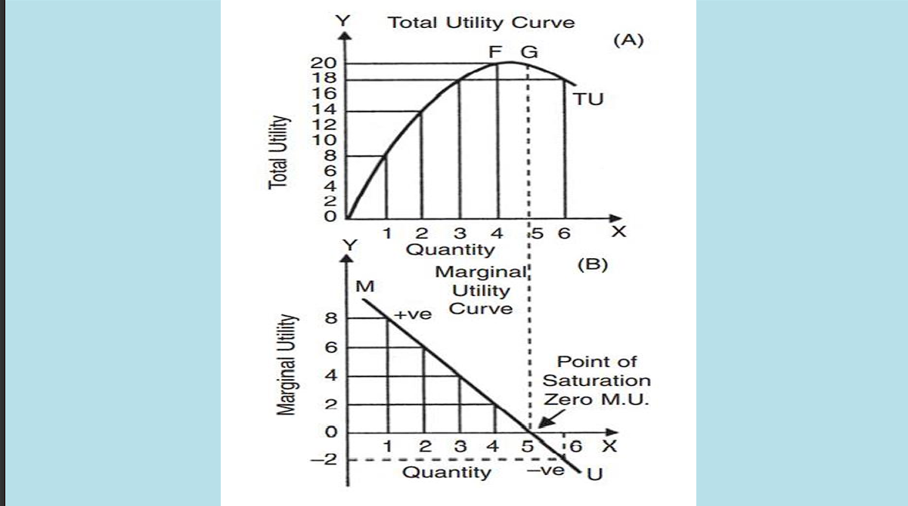

* **Stage 1 (Increasing Returns):** Both TU and MU increase at an increasing rate. *(Note: In standard DMU, this stage is often brief or skipped, as MU typically starts falling immediately).*
* **Stage 2 (Diminishing Returns):** MU starts falling but remains positive. TU increases at a diminishing rate. By the end of this stage, MU reaches zero, and TU reaches its absolute maximum.
* **Stage 3 (Negative Returns):** MU falls below zero (becomes negative). Consequently, TU starts falling.

---

## 6. Law of Equi-Marginal Utility
* **Statement:** To achieve maximum satisfaction, a consumer should allocate their limited income across different commodities so that the last rupee spent on each commodity yields equal marginal utility.
* **Equilibrium Condition:** $\frac{MU_1}{P_1} = \frac{MU_2}{P_2} = \frac{MU_3}{P_3}$

---

## 7. Indifference Curves (IC)
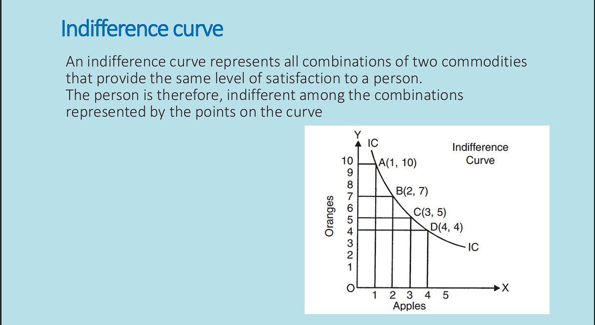
* **Definition:** A curve representing all combinations of two commodities that provide the exact same level of satisfaction to a person. 
* **Concept:** Because the satisfaction level is identical at every point on the curve, the consumer is "indifferent" to which combination they choose.
* **Example Schedule (Apples & Oranges):** * Point A: (1 Apple, 10 Oranges)
  * Point B: (2 Apples, 7 Oranges)
  * Point C: (3 Apples, 5 Oranges)
  * Point D: (4 Apples, 4 Oranges)

---

# Economics: Demand - Study Guide

## 1. Introduction to Demand
* **Demand:** The desire backed by the ability and willingness to pay for a commodity. It represents the quantity of goods and services consumers are willing to buy at a particular price at a given point in time.
* **Price:** The value of a thing expressed in terms of money.
* **Desire vs. Demand:** * Desiring a car without the money to buy it is merely wishful thinking, not demand.
  * Having the money but not wanting to spend it on a car also does not create demand.
  * **Demand** only emerges when you have the desire, the funds, *and* the readiness to spend those funds on the item.

---

## 2. Types of Demand

* **Individual Demand:** The demand for goods and services by a single consumer.
* **Market Demand:** The aggregate (total) demand for a product by all consumers in the market.
* **Derived (or Induced) Demand:** Occurs when the demand for one product is directly associated with the demand for another. *(Example: The demand for cotton yarn is derived from the demand for cotton cloth).*

---

## 3. Demand vs. Quantity Demanded
* **Demand:** Refers to the *entire schedule* of various quantities of a commodity that a consumer is ready to buy at different possible prices.
* **Quantity Demanded:** Refers to a *specific quantity* purchased at one *specific price*.
* **Example:** Your "Demand" is 2 ice creams at Rs. 15, and 4 ice creams at Rs. 10. Your "Quantity Demanded" is exactly 4 ice creams if the price is currently Rs. 10.

---

## 4. Determinants of Demand (Factors Affecting Demand)
Demand is influenced by multiple variables:
* **Price of the Commodity:** As price rises, demand falls (and vice versa).
* **Income of the Consumer ($Y$):**
  * **Normal Goods:** As income rises, demand rises.
  * **Inferior Goods:** As income rises, demand decreases (e.g., public transport).
  * **Exceptional Goods:** Demand remains constant regardless of income changes.
* **Taste and Preferences:** Demand fluctuates based on habits and preferences (e.g., cereal demand is high in the morning, low at night).
* **Price of Other Commodities:**
  * **Substitute Goods:** Goods that replace each other (e.g., Pepsi vs. Coke). If Coke's price rises, Pepsi's demand increases.
  * **Complementary Goods:** Goods used together (e.g., Car and fuel). If fuel prices rise, car demand decreases.
* **Consumer Expectations:** If consumers expect future price hikes, current demand increases.
* **Size of Population:** Larger populations drive higher aggregate demand.

---

## 5. Demand Function
The demand function illustrates the mathematical relationship between demand and its determinants.
* **Individual Demand Function:** $D_x = f(P_x, P_r, Y, T, E)$
* **Market Demand Function:** $D_x = f(P_x, P_r, Y, T, E, N, Y_d)$
  * *(Where: $P_x$ = Price of good, $P_r$ = Price of related goods, $Y$ = Income, $T$ = Tastes, $E$ = Expectations, $N$ = Population size, $Y_d$ = Distribution of income).*

---

## 6. Law of Demand
* **The Law:** Other things being constant (*Ceteris Paribus*), the demand for a good extends with a decrease in price and contracts with an increase in price. There is an **inverse relationship** between price and quantity demanded.
* **Assumptions (*Ceteris Paribus*):** Tastes, consumer income, prices of related goods, and future price expectations must remain constant.
* **Exceptions to the Law:**
  * **Giffen Paradox:** Highly inferior goods where demand rises as price rises.
  * **Veblen Effect:** Luxury goods bought for prestige/status (e.g., designer diamonds).
  * **Bandwagon Effect:** Buying goods just to imitate social groups.
  * **Speculation:** Buying more of a rising-price stock hoping it goes higher.
  * **Life-saving goods:** Medicines will be bought regardless of price hikes.

---

## 7. Demand Schedule and Curves
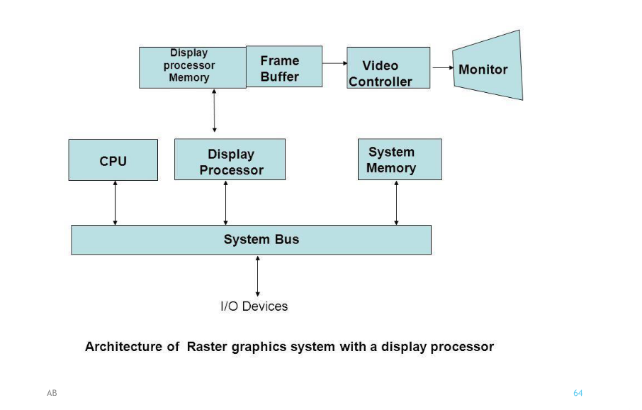
* **Demand Schedule:** A tabular representation showing different quantities demanded at different prices.
* **Demand Curve:** A graphical representation of the demand schedule (slopes downward from left to right).
* **Constructing the Market Demand Curve:** Derived by the **horizontal summation** of all individual demand curves. *(Example: At Rs. 4, if Consumer A buys 10 and Consumer B buys 15, Market Demand = 25).*

---
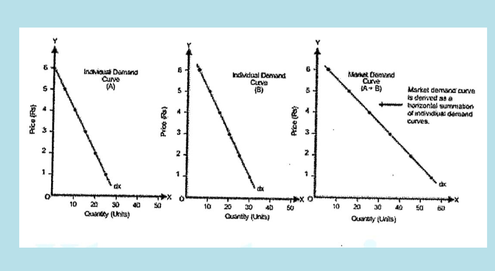

## 8. Changes in Demand
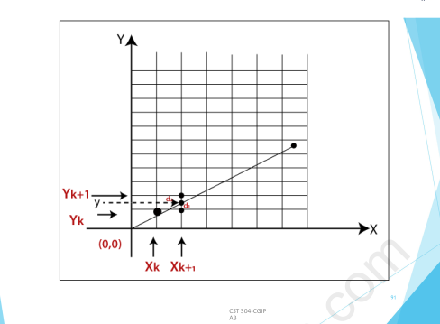
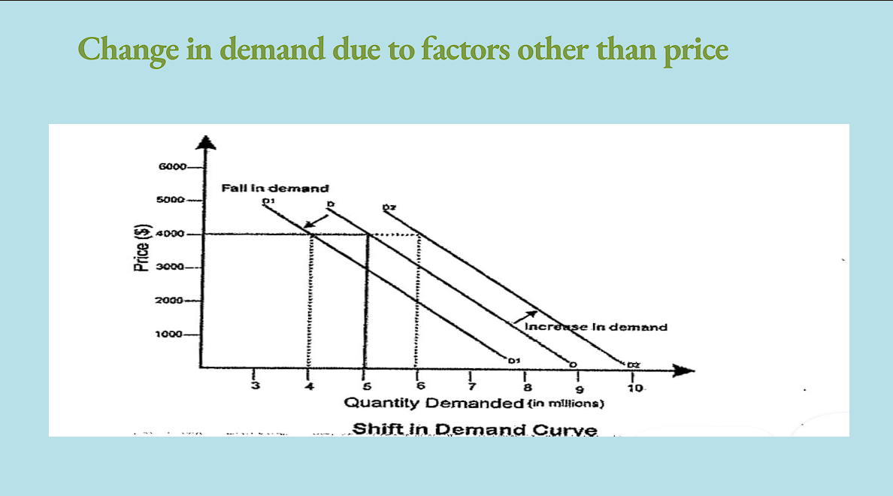

It is critical to distinguish between movements along the curve and shifts of the entire curve:

| Feature | Change due to **Price** | Change due to **Other Factors** (Income, Tastes, etc.) |
| :--- | :--- | :--- |
| **Terminology** | Extension or Contraction of Demand | Increase or Decrease in Demand |
| **Visual Effect** | **Movement along** the existing demand curve | **Complete shift** of the demand curve (Left or Right) |
| **Example** | Price falls $\rightarrow$ Move down the curve (Extension) | Income rises $\rightarrow$ Curve shifts right (Increase) |

---

# Elasticity of Demand: Study Guide

## 1. Introduction to Elasticity
* **Definition:** The degree of responsiveness of the quantity demanded of a commodity due to a change in its price or any other determinant factor.
* **Origin:** The concept was formulated by economist Alfred Marshall.
* **Core Types:** There are three main types of elasticity of demand:
    1.  Price Elasticity
    2.  Income Elasticity
    3.  Cross Elasticity

---

## 2. Price Elasticity of Demand ($E_p$)
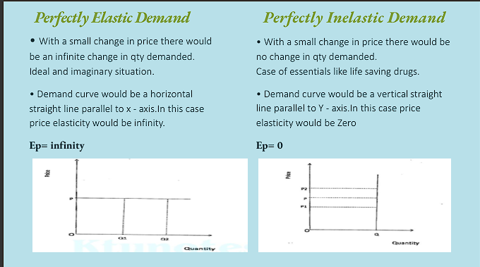
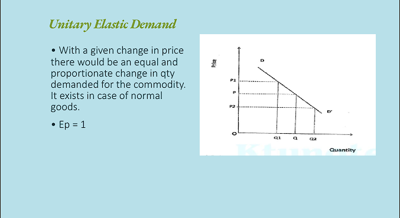
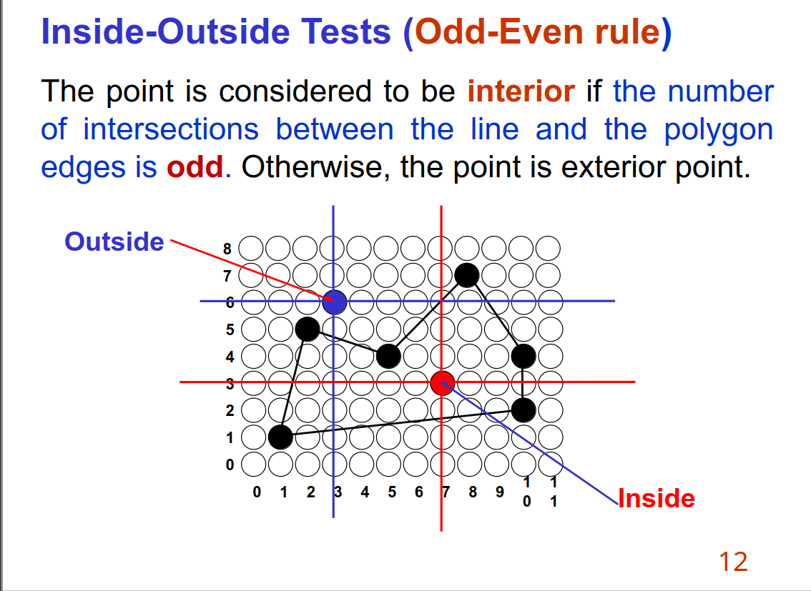
* **Definition:** The degree of responsiveness in the quantity demanded of a commodity directly resulting from a change in its price.

### The 5 Specific Types of Price Elasticity:
* **Perfectly Elastic Demand ($E_p = \infty$):** A small change in price causes an infinite change in quantity demanded. This is an ideal, theoretical situation. 
    * *Curve Shape:* A horizontal straight line parallel to the X-axis.
* **Perfectly Inelastic Demand ($E_p = 0$):** A change in price causes zero change in the quantity demanded. This exists for absolute essentials like life-saving drugs. 
    * *Curve Shape:* A vertical straight line parallel to the Y-axis.
* **Unitary Elastic Demand ($E_p = 1$):** A given change in price results in an equal and proportionate change in the quantity demanded. Common for normal goods.
* **Elastic / More Elastic Demand ($E_p > 1$):** A given change in price causes a *more* than proportionate change in the quantity demanded. Common for luxury items.
* **Inelastic / Less Elastic Demand ($E_p < 1$):** A given change in price causes a *less* than proportionate change in the quantity demanded. Common for basic necessities like food and fuel.

---

## 3. Measurement Methods for Price Elasticity

### A. Percentage Method
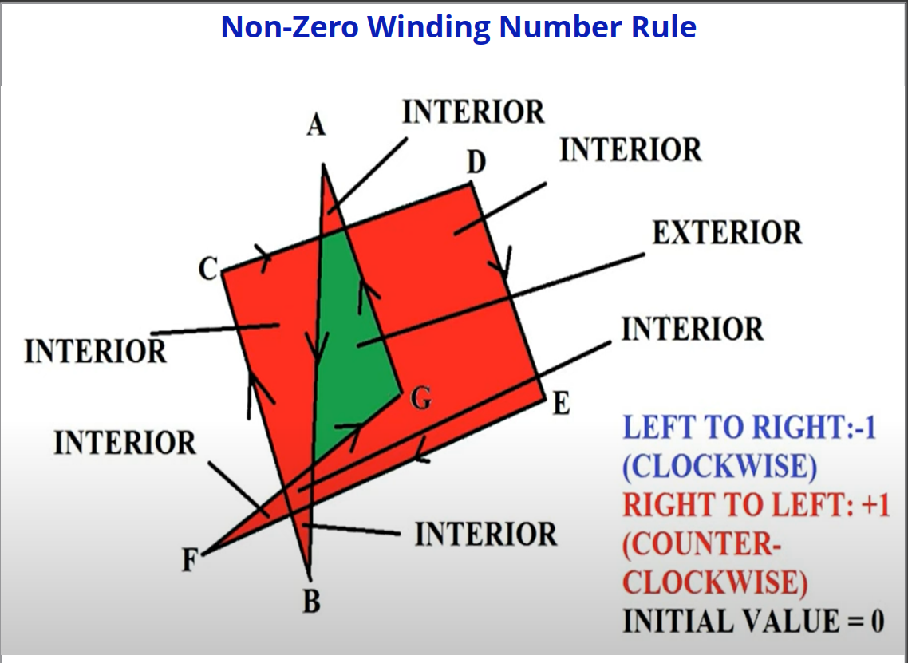
Calculated as the ratio of the percentage change in quantity demanded to the percentage change in its price. *(Note: The negative sign is conventionally ignored).*
$$E_d = \frac{\Delta Q}{Q} \div \frac{\Delta P}{P}$$

### B. Total Outlay / Expenditure Method
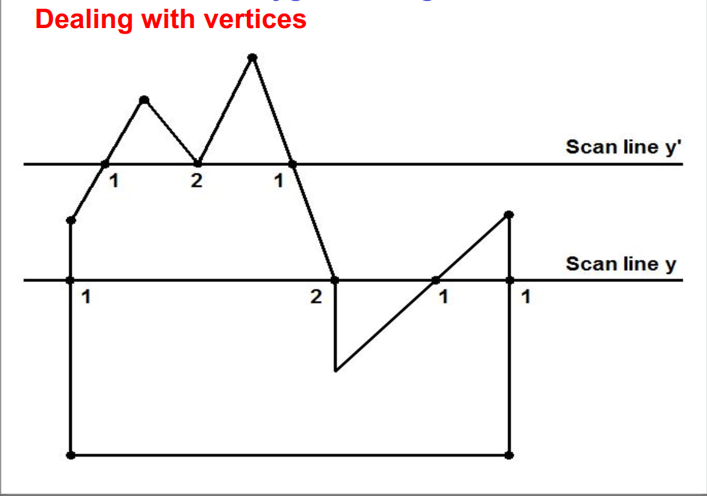
Examines how a change in price affects a consumer's total spending on a good.
* **Unitary Elastic ($E_d = 1$):** Total expenditure remains unchanged regardless of price fluctuations.
* **Elastic ($E_d > 1$):** Price and total expenditure move in the *opposite* direction. (Price ↑, Expenditure ↓).
* **Inelastic ($E_d < 1$):** Price and total expenditure move in the *same* direction. (Price ↑, Expenditure ↑).

### C. Arc Method
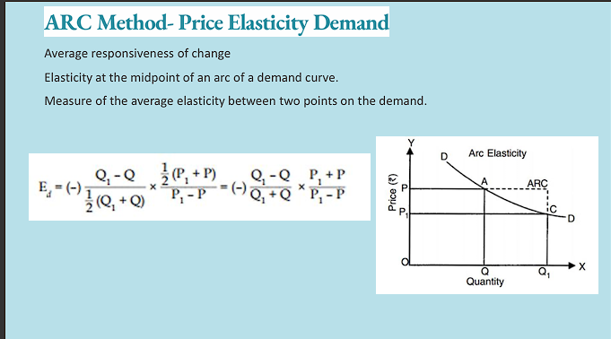
Measures the average elasticity between two distinct points on the demand curve (the midpoint of an arc).
$$E_d = \frac{Q_1 - Q}{Q_1 + Q} \div \frac{P_1 - P}{P_1 + P}$$

### D. Point Method
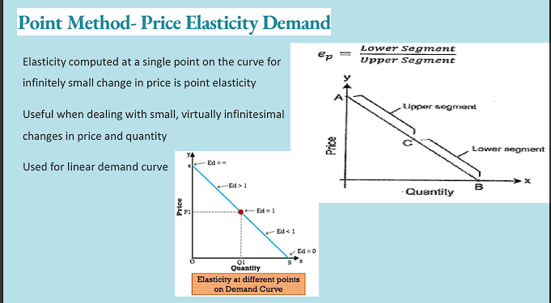
Computes elasticity at a single, specific point on a linear demand curve for infinitesimally small changes.
$$e_p = \frac{\text{Lower Segment}}{\text{Upper Segment}}$$
* *Scale along a linear curve:* Ranges from $E_d = \infty$ at the top (Y-axis intercept), drops to $E_d = 1$ exactly at the midpoint, and hits $E_d = 0$ at the bottom (X-axis intercept).

---

## 4. Income Elasticity of Demand ($e_y$)
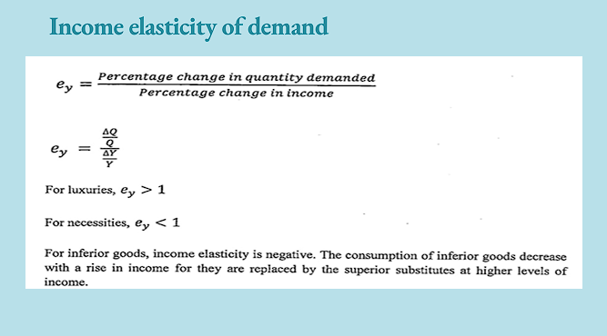
* **Definition:** The ratio of the percentage change in quantity demanded to the percentage change in consumer income.
* **Categorization by Value:**
    * **Luxuries:** $e_y > 1$
    * **Necessities:** $e_y < 1$
    * **Inferior Goods:** $e_y$ is negative. As income rises, consumption of these goods decreases because consumers switch to superior substitutes.

---

## 5. Cross Elasticity of Demand ($e_c$)
* **Definition:** The degree of responsiveness of demand for Commodity X to a change in the price of a related Commodity Y.
* **Formula:**
$$e_c = \frac{\%\text{ change in quantity demanded of X}}{\%\text{ change in price of Y}} = \frac{\Delta Q_x / Q_x}{\Delta P_y / P_y}$$

* **Interpreting the Relationship:**
    * **Substitute Goods:** $e_c$ is positive (e.g., if coffee gets expensive, tea demand rises).
    * **Complementary Goods:** $e_c$ is negative (e.g., if fuel gets expensive, car demand falls).
    * **Unrelated Goods:** $e_c$ is exactly zero.

 

# Principles of Supply: Study Guide

## 1. Introduction to Supply
* **Definition:** The quantity of a good or service that producers are willing and able to offer for sale at a given price during a specific period.

---

## 2. Determinants of Supply
Several external and internal factors dictate the supply of a commodity:
* **Price of the commodity:** Generally, as the price rises, the supply rises.
* **Price of related commodities:** Influences a producer's decision to supply one good over another (e.g., switching from wheat to corn if corn prices rise).
* **Number of firms:** More firms entering the market typically increases overall market supply.
* **Goals of the firm:** A firm's focus on profit maximization versus sales maximization impacts its supply levels.
* **Price of factors of production:** The cost of inputs (labor, raw materials) affects how much can be produced profitably.
* **State of technology:** Technological advancements make production more efficient, thereby increasing supply.
* **Expected future price:** If producers expect higher prices in the future, they may withhold current supply to sell later.
* **Government policy:** Taxes, subsidies, and strict regulations directly impact production costs and overall supply.

**The Supply Function:**
The mathematical relationship between supply and its determinants can be expressed as:
$S_x = f(P_x, P_r, NF, G, PF, T, E_x, GP)$

---

## 3. The Law of Supply
* **Statement:** "Other things remaining constant, the quantity supplied increases with a rise in the price of the commodity and the quantity supplied decreases with a fall in the price of the commodity."
* **Assumptions of the Law:** For this direct relationship to hold true, the "other things" must remain completely constant:
  * There is no change in the prices of the factors of production.
  * There is no change in the technique of production.
  * There is no change in the goal of the firm.
  * There is no change in the prices of related goods.
  * Producers do not expect a change in the price of the commodity in the near future.

---

## 4. Supply Schedules and Curves
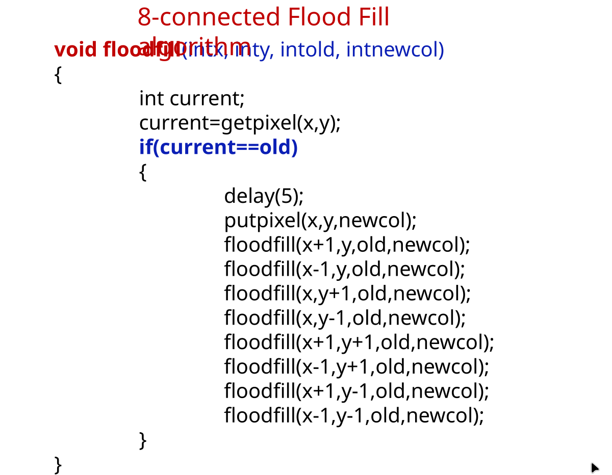
* **Supply Schedule:** A tabular representation showing the amounts of a commodity supplied at various prices during a given period of time.
* **Supply Curve:** The graphical representation of the supply schedule (typically sloping upwards from left to right).
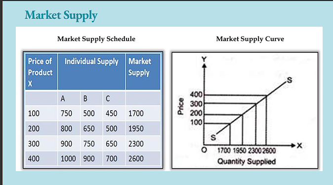
* **Market Supply:** Represents the aggregate total supply in the entire market. It can be visualized using a Market Supply Schedule and a Market Supply Curve.

---

## 5. Changes in Supply
It is critical to distinguish between the two ways supply can change:
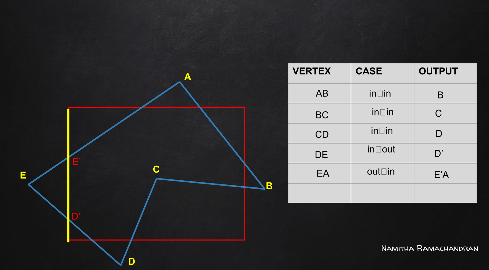
* **Change due to Price:** This causes a physical **movement along** the existing supply curve.
  * **Expansion:** An increase in quantity supplied due to a rise in price.
  * **Contraction:** A decrease in quantity supplied due to a fall in price.

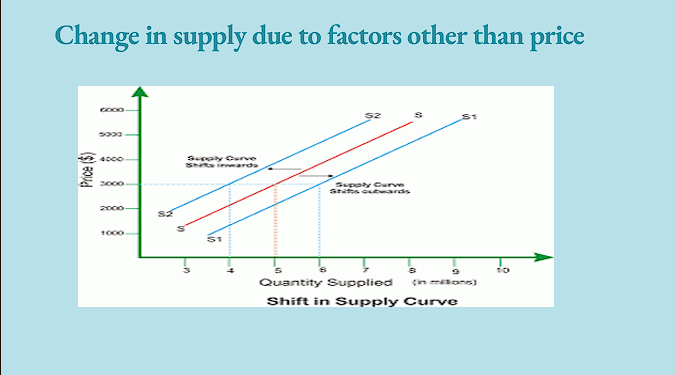
* **Change due to Factors Other Than Price:** This causes a complete **shift** of the entire supply curve.
  * **Increase in Supply:** The curve shifts outwards (to the right).
  * **Decrease in Supply:** The curve shifts inwards (to the left).

---

## 6. Elasticity of Supply ($E_s$)
* **Definition:** The degree of responsiveness of the quantity supplied of a commodity due to a change in price or any other factors.
* *(Note: Under this specific curriculum, only **price elasticity** is considered for $E_s$.)*

### The Five Types of Supply Elasticity
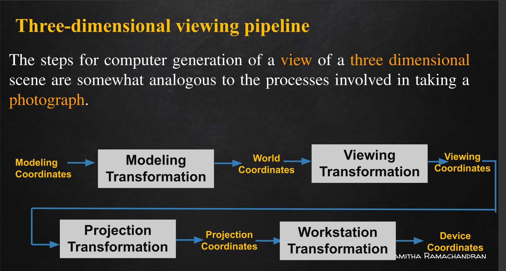
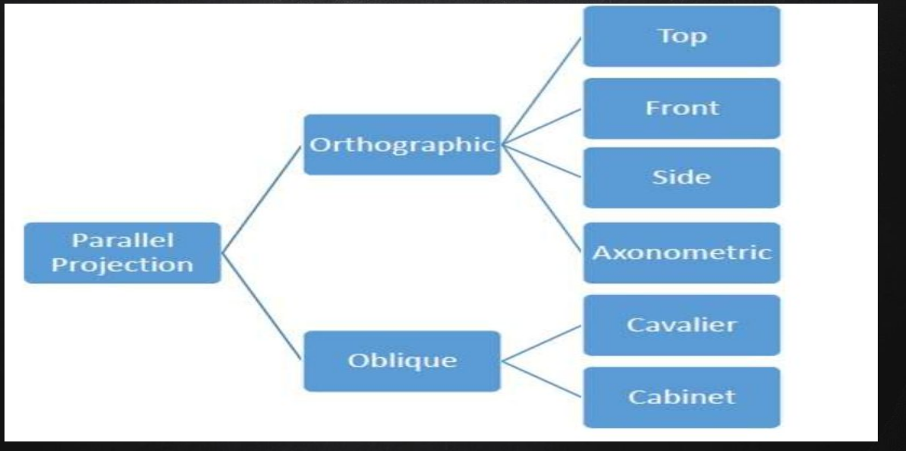
1. **Perfectly Elastic Supply ($E_s = \infty$):** With a small change in price, there is an infinite change in quantity supplied. 
   * *Curve Shape:* A horizontal straight line parallel to the X-axis.
2. **Perfectly Inelastic Supply ($E_s = 0$):** With a small change in price, there is zero change in the quantity supplied. 
   * *Curve Shape:* A vertical straight line parallel to the Y-axis.
3. **Unitary Elastic Supply ($E_s = 1$):** With a given change in price, there is an equal and proportionate change in the quantity supplied for the commodity.
4. **Less Elastic / Inelastic Supply ($E_s < 1$):** With a given change in price, there is a less than proportionate change in the quantity supplied.
5. **More Elastic / High Elastic Supply ($E_s > 1$):** With a given change in price, there is a more than proportionate change in the quantity supplied.

# Market Equilibrium & Efficiency: Study Guide

## 1. Market Equilibrium
* **Definition:** The market condition where the quantity supplied ($Q_s$) is exactly equal to the quantity demanded ($Q_d$). 
* **Equilibrium Price ($P_0$):** At this specific price point, there is no tendency for the market price to change because the wishes of buyers and sellers perfectly coincide.
* **The "Invisible Hand":** A concept describing how individual buyers and sellers, acting strictly in their own self-interest, naturally drive the market toward equilibrium. Because of this natural balancing effect, demand and supply are referred to as the invisible hands of the market.

---

## 2. Market Disequilibria: Shortages and Surpluses
When a market is out of balance, the price will naturally tend to rise or fall until equilibrium is successfully restored.
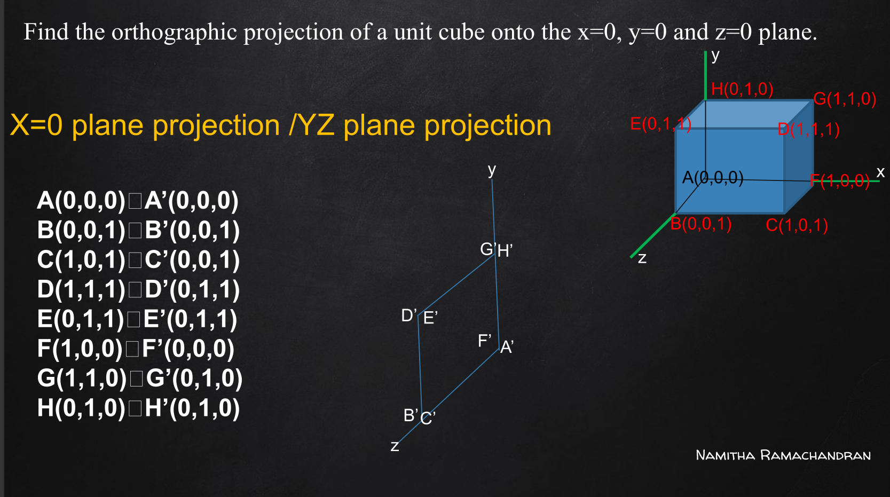
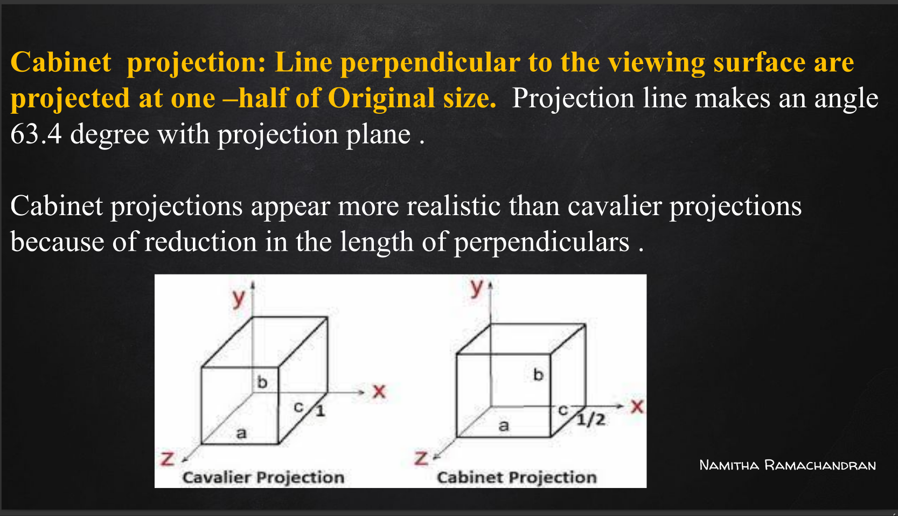
* **Excess Supply (Surplus):** Occurs when the market price is set too high. 
  * *Example:* At a price of 8, market supply is 5,000 units, but market demand is only 1,000 units.
* **Excess Demand (Shortage):** Occurs when the market price is set too low. 
  * *Example:* At a price of 4, market demand is 5,000 units, but market supply is only 1,000 units.
* **Reaching Equilibrium:** Using the data model above, the market naturally settles at a price of 6, where both supply and demand are perfectly matched at 3,000 units.

---

## 3. Shifts in Demand and Supply
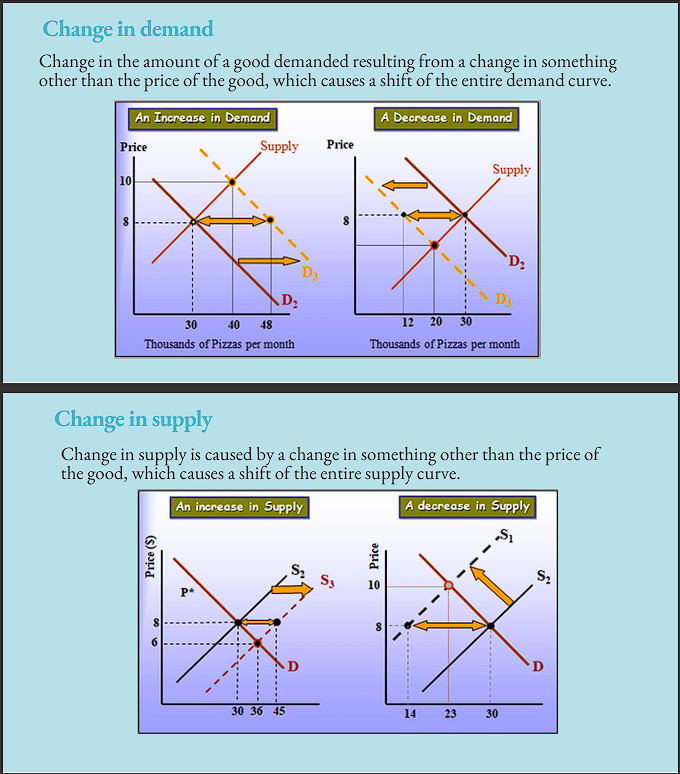

* **Changes in Demand:** Caused by non-price factors, resulting in a shift of the *entire* demand curve.
  * **Higher Demand (Outward Shift):** Leads to a higher equilibrium price and a higher equilibrium quantity.
  * **Lower Demand (Inward Shift):** Leads to a lower equilibrium price and a lower equilibrium quantity.
* **Changes in Supply:** Caused by non-price factors, shifting the *entire* supply curve.
  * **Higher Supply (Outward Shift):** Leads to a lower equilibrium price but a higher equilibrium quantity.
  * **Lower Supply (Inward Shift):** Leads to a higher equilibrium price and a lower equilibrium quantity.

---

## 4. Simultaneous Market Changes
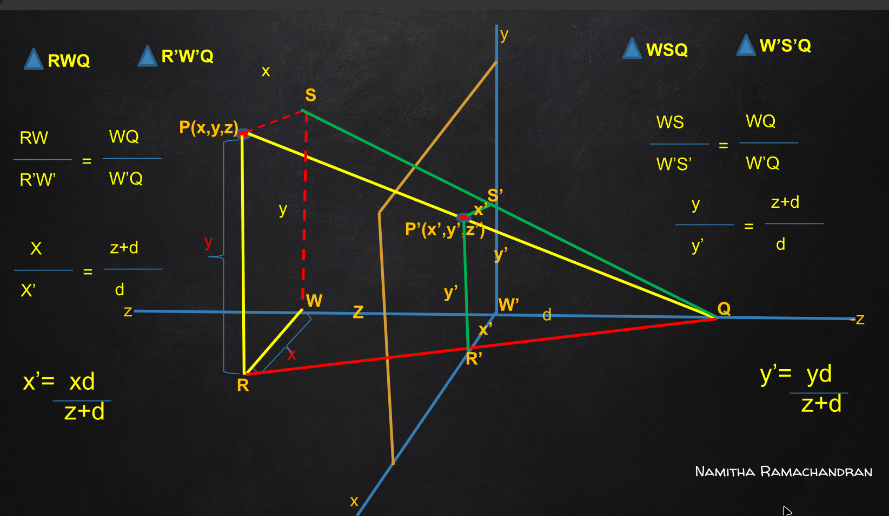   
* **The Rule of Magnitude:** When both supply and demand change at the same time, the relative magnitudes of those shifts dictate the final market equilibrium.
* **Example:** If *both* supply and demand increase simultaneously, the equilibrium quantity will definitively increase. However, the resulting price may go up or down depending entirely on which shift (supply or demand) was more significant.

---

## 5. Consumer and Producer Surplus
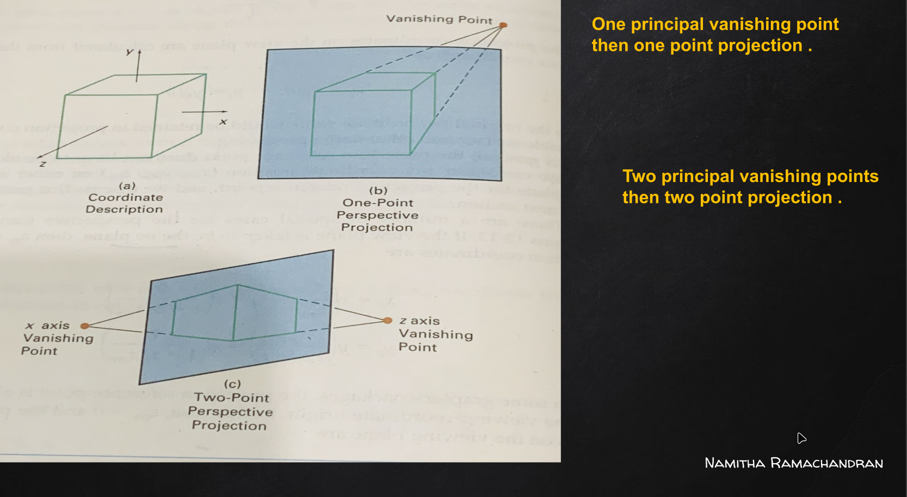
* **Consumer Surplus:** The difference between a consumer's willingness to pay for a commodity and the actual market price they end up paying.
  * *Rule:* Consumer surplus always increases as the price of a good falls, and decreases as the price rises.
* **Producer Surplus:** The difference between the amount a seller receives for a good and the absolute minimum price they would have accepted (which equals their marginal cost).
  * *Rule:* This surplus represents the actual net benefit the producer receives from participating in the market.

---

## 6. Taxation Basics
* **Definition:** A system by which a government levies a compulsory contribution on citizens and businesses to fund government expenses. 
* **Types:** Categorized primarily into direct and indirect taxes.
* **Market Impact:** Imposing a tax alters the market equilibrium. It increases the final price buyers pay while simultaneously decreasing the net price sellers receive. Because of these dual effects, the overall economic burden of a tax is shared by both buyers and sellers.

---

## 7. Deadweight Loss
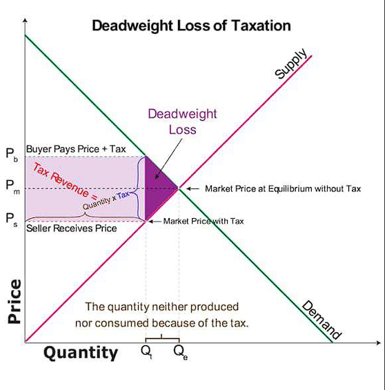
* **Definition:** An economic cost to society created by market inefficiency, occurring when supply and demand are forced out of equilibrium.
* **Nature of the Loss:** It is an *irrecoverable* reduction in overall economic efficiency caused by an intervention (like a tax or price ceiling) or a market shock.
* **Taxation Effect:** When a tax is introduced, the resulting fall in both consumer surplus and producer surplus creates this deadweight loss. 
* **Graphical Representation:** On a market graph, deadweight loss represents the quantity of goods that are neither produced nor consumed strictly because of the restrictive presence of the tax.