***

# **Comprehensive Study Notes: The Theory of Production**

## **1. Introduction to Production**
In economics, production goes beyond just manufacturing physical goods; it encompasses **any activity that generates utility**.

* **Definition:** A process that creates or adds value and utility to a product. It is any economic activity that transforms inputs into outputs capable of satisfying human wants.
* **Key Drivers of Production Levels:** * Quantity of resources used
    * Current level of technology
    * Size of the firm
    * Relative price of factors
* **Factors of Production (Inputs):** The primary resources required for production include **Land**, **Labor**, **Capital**, and **Enterprise**.

---

## **2. The Production Function**
The production function is a fundamental mathematical expression used in microeconomics to map inputs to outputs.

* **Core Concept:** It states the technical or physical relationship between the factors of production (inputs) and the quantity of products produced (outputs).
* **General Equation:** $$Q=f(La,L,K,E)$$ 
    *(Where: $Q$ = Output, $La$ = Land, $L$ = Labor, $K$ = Capital, and $E$ = Enterprise)*
* **Simplified Equation:** For ease of calculation and graphing, economists often reduce this to the simplest form involving just two inputs: 
    $$Q=f(L,K)$$

---

## **3. Classification of Inputs**
Inputs are categorized based on how easily and quickly a firm can adjust them to change output levels.

| Input Type | Definition | Common Examples |
| :--- | :--- | :--- |
| **Fixed Inputs** | Factors of production that *cannot* be changed temporarily or quickly. | Manufacturing plants, large buildings, highly specialized workers. |
| **Variable Inputs** | Factors of production that *can* be changed temporarily and quickly. | Raw materials, general workers, hourly labor. |

---

## **4. Types of Production Functions**
Production functions are classified by two main criteria: the **proportion of inputs used** and the **time period**.

### **A. Based on Proportion of Inputs Used**
* **Fixed Proportion Production Function (Leontief):** Factors of production are used in a strict, fixed ratio. The firm cannot vary the proportion of the factors (like labor and capital) regardless of the desired level of output.
* **Variable Proportion Production Function:** Factors of production are used in variation, meaning alternative combinations of inputs can be used to achieve the same output.
* **Homogeneous Production Function:** A mathematical function where scaling all inputs by the exact same factor scales the output by a predictable power of that factor. The Cobb-Douglas production function is a famous example.
    * **Formula:** $$f(tx,ty)=t^k f(x,y)$$ *(for all $t>0$)*

### **B. Based on Time Period**
In economics, time periods are defined by the flexibility of inputs, not by days or months.

* **Short Run Production Function:**
    * **Definition:** A period in which *at least one or more factors of production are fixed*, while others are variable (commonly, capital is fixed, labor is variable).
    * **Example:** A restaurant can easily hire more waitstaff (variable) but needs significant time to expand the physical kitchen space (fixed).
    * **Governing Economic Law:** **The Law of Variable Proportions** (also known as Returns to a Factor).
* **Long Run Production Function:**
    * **Definition:** A period in which *all factors of production or inputs are variable*; there are absolutely no fixed factors. The firm can freely increase or decrease any input.
    * **Governing Economic Law:** **The Law of Returns to Scale**.

---

## **5. Concepts of Output (Product)**
To measure production efficiency, economists analyze output through three distinct lenses. 

* **Total Product (TP) / Total Physical Product (TPP) / Total Returns:** The total amount of a commodity produced during a given period with a specific set of inputs.
* **Average Product (AP):** The output produced per single unit of the variable factor input.
    * **Formula:** $$AP=TP/L$$ *(where $L$ represents the variable factor, usually labor)*
* **Marginal Product (MP):** The change in total product that results from the use of one additional (or one less) unit of the variable factor.
    * **Formula:** $$MP=\Delta TP/\Delta L$$

---

## **6. Advanced Context: The Economic Laws**
These foundational relationships govern how businesses optimize their production and costs. 

### **The Relationship Between TP, AP, and MP**

Understanding how these three curves interact is crucial for short-run production analysis:
* When **MP > AP**, the Average Product curve is *rising*.
* When **MP < AP**, the Average Product curve is *falling*.
* When **MP = AP**, the Average Product curve is at its *absolute maximum*.
* When **MP = 0**, Total Product (TP) is at its *maximum peak*. 
* If **MP becomes negative**, Total Product (TP) begins to *decline*.

### **Expanding on the Economic Laws**

> **The Law of Variable Proportions (Short Run)**
> As you add more units of a variable input (like labor) to a fixed input (like a factory), total output will initially increase at an increasing rate, then increase at a diminishing rate, and eventually decline. This creates three stages:
> 1.  **Stage 1:** Increasing Returns
> 2.  **Stage 2:** Diminishing Returns *(Rational firms always choose to produce here)*
> 3.  **Stage 3:** Negative Returns

> **The Law of Returns to Scale (Long Run)**
> Because all inputs can be scaled up or down in the long run, this law examines how output responds to a proportionate change in all inputs.
> * **Constant Returns to Scale:** Doubling inputs *exactly doubles* output.
> * **Increasing Returns to Scale (Economies of Scale):** Doubling inputs *more than doubles* output.
> * **Decreasing Returns to Scale (Diseconomies of Scale):** Doubling inputs *yields less than double* the output.

***

# **College Notes: Theory of Production**

## **Part I: The Short Run – Law of Variable Proportions**
The short run is a period where **at least one factor of production is fixed**. This law examines the relationship between varying one input and the resulting output produced, while keeping all other factor inputs constant.

* **Alternative Names:** The Law of Diminishing Returns, The Law of Diminishing Marginal Product.
* **Core Mechanism:** When a factor of production is increased while all other factors remain fixed, it alters the proportional averages of the factors being used.

### **Key Assumptions of the Law**
* Only **one** factor of production is variable; all others are fixed.
* There is **no change** in the production technique (technology is assumed to be constant).
* Factors of production can be used in **various proportional averages** (e.g., a farmer could use 1 worker for 1 hectare, or 4 workers for 2 hectares).

> **Statement of the Law**
> *The Law of Variable Proportions states that as more and more units of a variable factor are applied to a fixed quantity of another factor, the Total Product (TP) will initially increase at an increasing rate, but eventually, it will increase at a diminishing rate.*

---

### **The Three Stages of Production**

#### **Stage I: Increasing Returns to a Factor**
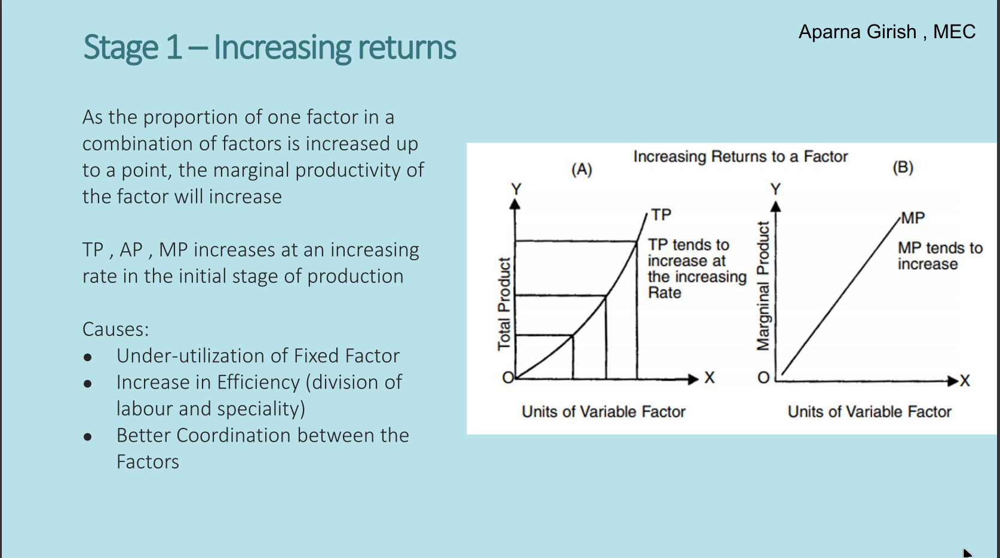
* **Behavior:** As the proportion of the variable factor increases up to a certain point, its marginal productivity also increases. Total Product (TP), Average Product (AP), and Marginal Product (MP) all increase at an increasing rate.
* **Causes:**
  * The fixed factor is initially under-utilized.
  * Adding more labor leads to increased efficiency through division of labor and specialization.
  * Better coordination between fixed and variable factors.

#### **Stage II: Diminishing Returns to a Factor** *
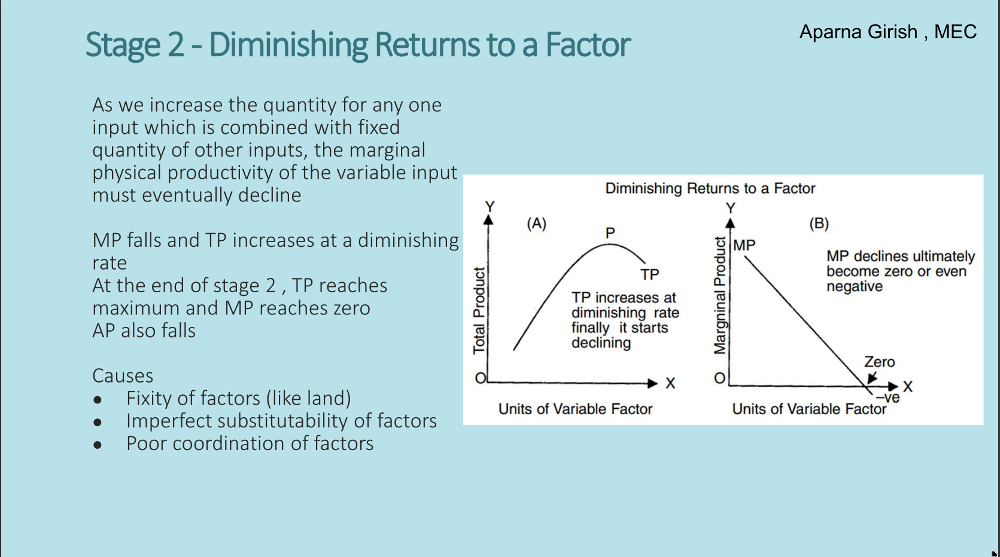(Rational firms operate here)*
* **Behavior:** As the variable input continues to increase alongside fixed inputs, its marginal physical productivity eventually declines. MP falls, TP increases (but at a diminishing rate), and AP begins to fall.
* **Crucial Turning Point:** At the end of Stage II, **Total Product (TP) reaches its absolute maximum**, and **Marginal Product (MP) drops exactly to zero**. 
* **Causes:**
  * The fixity of certain factors (e.g., limited land or machinery).
  * Imperfect substitutability of factors (labor cannot indefinitely replace capital).
  * Poor coordination or overcrowding of the factors.

#### **Stage III: Negative Returns to a Factor**
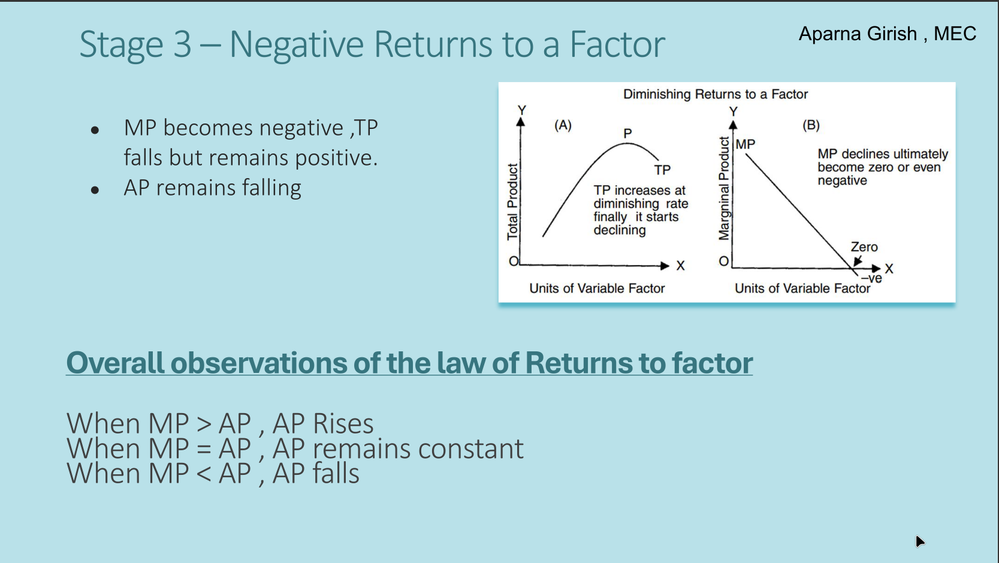
* **Behavior:** MP drops below zero (becomes negative). Because marginal contributions are negative, TP falls (though it remains positive). AP continues its falling trajectory. *No rational producer operates in this stage because adding more workers actively reduces total output.*

### **Mathematical Relationship Between MP and AP**
* When $MP > AP$, the Average Product (AP) **rises**.
* When $MP = AP$, the Average Product (AP) **remains constant** (it has peaked).
* When $MP < AP$, the Average Product (AP) **falls**.

### **Short-Run Production Schedule**

| Units of Labour | Total Product (TP) | Average Product (AP) | Marginal Product (MP) | Stages of Production |
| :---: | :---: | :---: | :---: | :--- |
| 1 | 8 | 8 | 8 | **Increasing Returns (Stage I)** |
| 2 | 20 | 10 | 12 | |
| 3 | 34 | 11 | 14 | |
| 4 | 46 | 11.5 | 12 | **Decreasing Returns (Stage II)** |
| 5 | 54 | 11 | 8 | |
| 6 | 56 | 9 | 2 | |
| 7 | 56 | 8 | 0 | |
| 8 | 54 | 7 | -2 | **Negative Returns (Stage III)** |

***
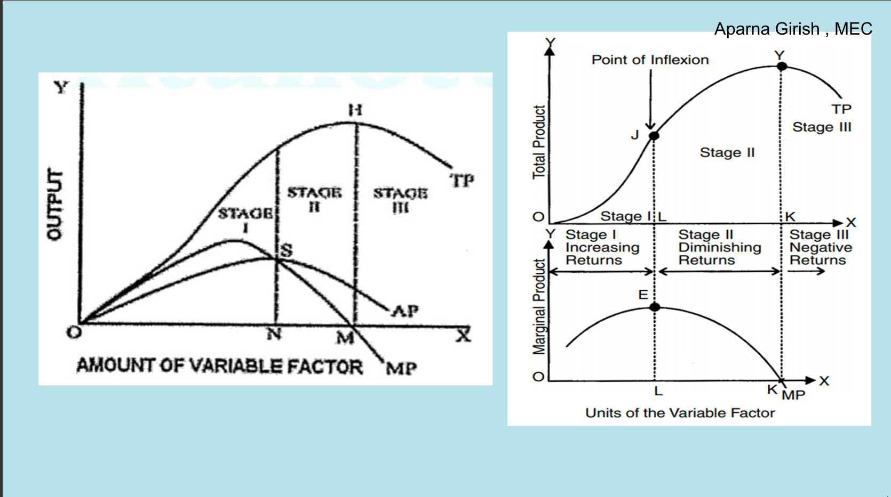

## **Part II: The Long Run – Law of Returns to Scale**
Unlike the short run, the long run represents a time frame where there are **no fixed constraints**; all factor inputs are variable. The Law of Returns to Scale describes how output changes when all inputs are changed simultaneously in the **same, equal proportion**.

### **The Three Stages of Returns to Scale**
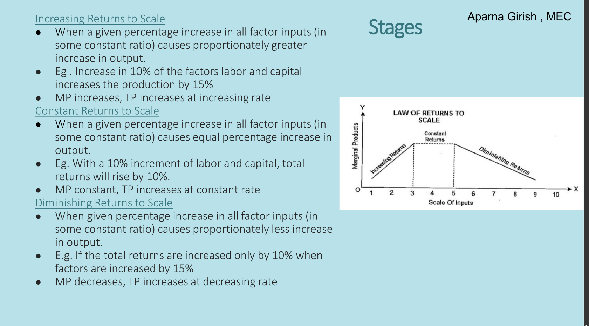

#### **1. Increasing Returns to Scale**
* **Definition:** A given percentage increase in all factor inputs causes a *proportionately greater* increase in output.
* **Metrics:** MP increases, and TP increases at an increasing rate.
* **Example:** Increasing labor and capital by 10% results in a 15% increase in total production. *(Driven by internal economies of scale: bulk buying, specialized machinery, management efficiency).*

#### **2. Constant Returns to Scale**
* **Definition:** A given percentage increase in all factor inputs causes an *exactly equal* percentage increase in output.
* **Metrics:** MP remains constant, and TP increases at a constant rate.
* **Example:** Increasing labor and capital by 10% causes total returns to rise by precisely 10%. *(Economies of scale are exhausted, but severe bottlenecks have not yet begun).*

#### **3. Diminishing Returns to Scale**
* **Definition:** A given percentage increase in all factor inputs causes a *proportionately lesser* increase in output.
* **Metrics:** MP decreases, and TP increases at a decreasing rate.
* **Example:** Increasing factor inputs by 15% yields only a 10% increase in total returns. *(Driven by diseconomies of scale: communication breakdowns, bureaucratic inefficiency, lack of coordination).*

### **Long-Run Production Schedule**

| Units of Labour | Units of Capital | % Increase in Labour & Capital | Total Production | % Increase in Total Production | Returns to Scale Stage |
| :---: | :---: | :---: | :---: | :---: | :--- |
| 1 | 2 | - | 10 | - | - |
| 2 | 4 | 100% | 30 | 200% | **Increasing** |
| 3 | 6 | 50% | 60 | 100% | **Increasing** |
| 4 | 8 | 33% | 80 | 33% | **Constant** |
| 5 | 10 | 25% | 100 | 25% | **Constant** |
| 6 | 12 | 20% | 110 | 10% | **Decreasing** |
| 7 | 14 | 16% | 120 | 9% | **Decreasing** |
| 8 | 16 | 14% | 125 | 4% | **Decreasing** |

***

# **College Notes: Theory of Costs and Scale**

## **Part 1: The Theory of Costs and Scale**

### **1. Economies of Scale**
Economies of scale refer to the structural advantages and cost benefits that accrue to a firm or industry as a result of expanding the scale of production. 
* **Core Principle:** Increasing the scale of production leads to a *lower* cost per unit of output. 
* **Graphical Impact:** This typically manifests as a downward-sloping Long-Run Average Cost (LRAC) curve.

Economies of scale are broadly classified into two categories:

#### **A. Internal Economies**
These are cost reductions that arise from *within the firm itself* as its specific scale of production increases. These advantages are exclusive to the expanding firm.
* **Labour Economies:** Large-scale production allows for the division of labor and specialized workforce roles, increasing overall efficiency and output per worker.
* **Technical / Technological Economies:** Larger firms have the capital to invest in advanced, up-to-date technologies and specialized machinery that smaller firms cannot afford.
* **Commercial / Purchasing Economies:** By placing bulk orders for raw materials and components, large firms can negotiate lower prices and better trade discounts.
* **Management / Managerial Economies:** The ability to employ specialist management personnel across highly structured departments (e.g., distinct HR, Finance, and IT teams).
* **Marketing Economies:** The producer gains better bargaining power in the market. Marketing costs (like advertising) are spread over a much larger volume of sales.
* **Financial Economies:** Large firms are perceived as more creditworthy, allowing them to fetch more capital at lower interest rates from financial institutions.
* **Risk-bearing Economies:** Firms with massive scale possess diverse, multi-production capabilities, placing them in a better position to withstand sudden business risks or localized market downturns.

#### **B. External Economies**
These are cost-saving advantages that occur when a firm's cost per unit of output decreases as the *entire industry* grows. These benefits are shared by all firms in that industry.
* **Economies of Concentration:** As an industry clusters geographically, specialized suppliers and a pool of skilled labor naturally develop there.
* **Economies of Information:** Industry growth leads to the establishment of specific journals, research hubs, and shared technological knowledge.
* **Economies of Mobilising Capital:** It becomes easier to raise capital as financial markets become familiar with a booming industry. This also includes advantages like better transport, communication linkages, and trade facilities.

---

### **2. Diseconomies of Scale**
If a firm or industry expands beyond an optimum point, it will begin to experience diseconomies of scale—a situation where the cost per unit of output *increases* as the scale of production increases. This causes the LRAC curve to slope upwards.

#### **A. Internal Diseconomies**
Factors that raise the cost of production for a specific firm when its scale is increased beyond the optimum point.
* **Managerial Inefficiency:** Top management finds it increasingly difficult to coordinate, communicate, and control a massive, unwieldy organization.
* **Purchasing Limits:** Previously enjoyed "bulk purchase" economies turn into diseconomies, potentially due to warehousing costs or supplier constraints.
* **Marketing Overheads:** Expenditures on advertising and marketing begin to increase more than proportionately.
* **Financial Constraints:** Financial costs rise as continuous growth eventually hits the limits imposed by the state of the capital market.

#### **B. External Diseconomies**
Occur when a firm's unit cost increases because the size of the *whole industry* has grown too large.
* **Input Shortages:** Rapid expansion leads to a shortage of raw materials and skilled labor, driving up their prices.
* **Localization Disadvantages:** Over-concentration in one area leads to traffic congestion, heightened marketing costs, and surging housing costs for workers.
* **Environmental Costs:** Massive industrial concentration results in high pollution costs, regulatory fines, or necessary mitigation expenditures.

---

## **Part 2: Production Analysis (Isocosts and Isoquants)**

### **1. The Isoquant Curve**
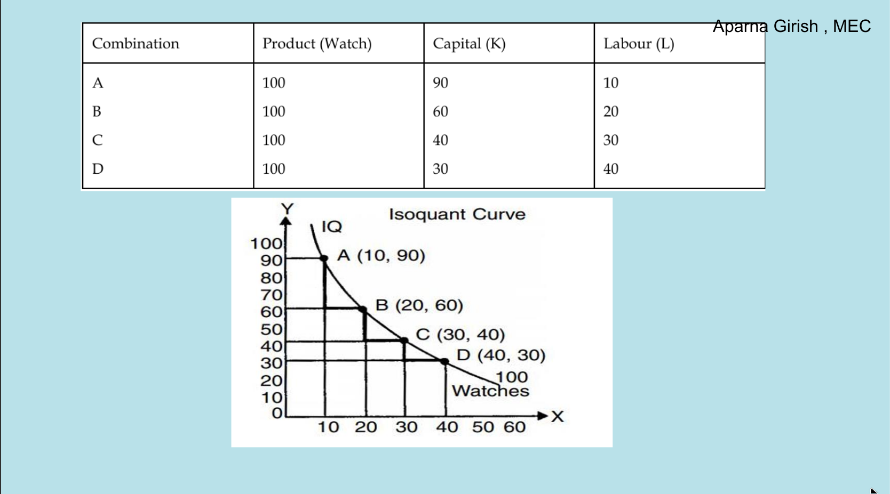
An isoquant (*"Iso"* = equal, *"Quant"* = quantity) is a curve representing the various combinations of two factor inputs (usually Capital, $K$, and Labour, $L$) that yield the *exact same* level of output. Also known as Iso-product curves or Equal product curves.

**Properties of Isoquants:**
* **Downward Sloping:** They slope downward from left to right due to the Marginal Rate of Technical Substitution (MRTS). If you reduce capital, you must increase labor to maintain output.
* **MRTS:** The slope of the isoquant represents the MRTS. It is the specific amount of labor required to replace one unit of capital while maintaining the same level of output.
* **Convex to the Origin:** This represents the Diminishing Marginal Rate of Technical Substitution; as you use more labor, it becomes increasingly difficult to substitute it for capital.
* **Non-intersecting:** Two different isoquants can never cut or intersect, as this would illogically imply the same input combination yields two different output levels.
* **Higher Isoquant = Higher Output:** An isoquant lying above and to the right of another indicates a higher level of total production.

### **2. The Isocost Line**
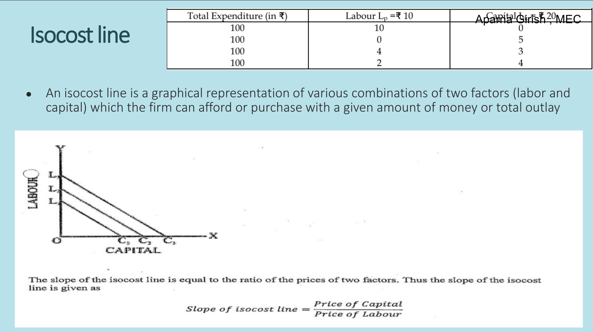
An isocost line is a graphical representation showing the various combinations of two factors (labor and capital) that a firm can afford to purchase given a specific, fixed amount of money (total outlay).

* **Mathematical Context:** If $C$ is total cost, $w$ is the price of labor, and $r$ is the price of capital, the equation is:
  $$C=wL+rK$$
* **Slope:** The slope is equal to the ratio of the prices of the two factor inputs. Depending on the axis configuration, this slope is driven by the relationship between the price of capital and the price of labor.

---

## **Part 3: Equilibrium and Long-Run Expansion**

### **1. Producer's Equilibrium (Least Cost Combination)**
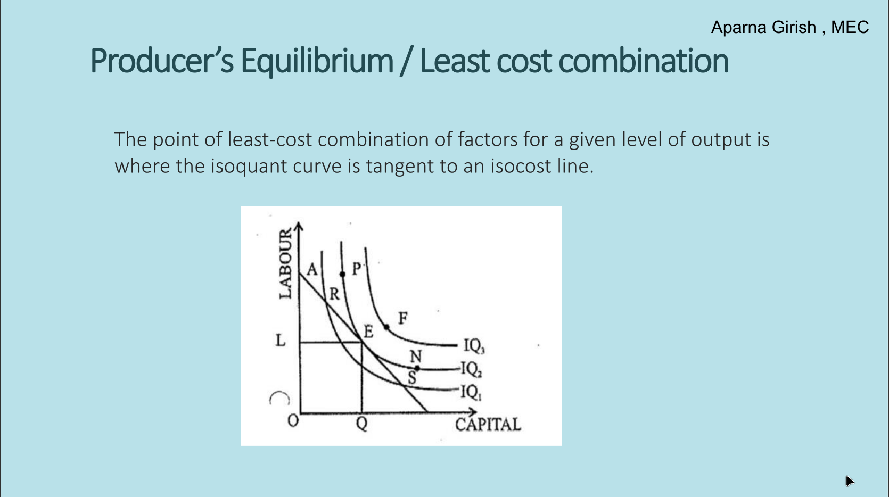
The primary goal of a rational producer is to maximize output for a given cost, or minimize cost for a given output. 
* **The Point of Equilibrium:** Achieved exactly where the isoquant curve is **tangent** to an isocost line. At this tangency point, the firm is utilizing the optimal mix of capital and labor.

> **Economic Condition:** At this point, the slope of the Isoquant (MRTS) perfectly equals the slope of the Isocost line (Ratio of factor prices).

### **2. Expansion Path**
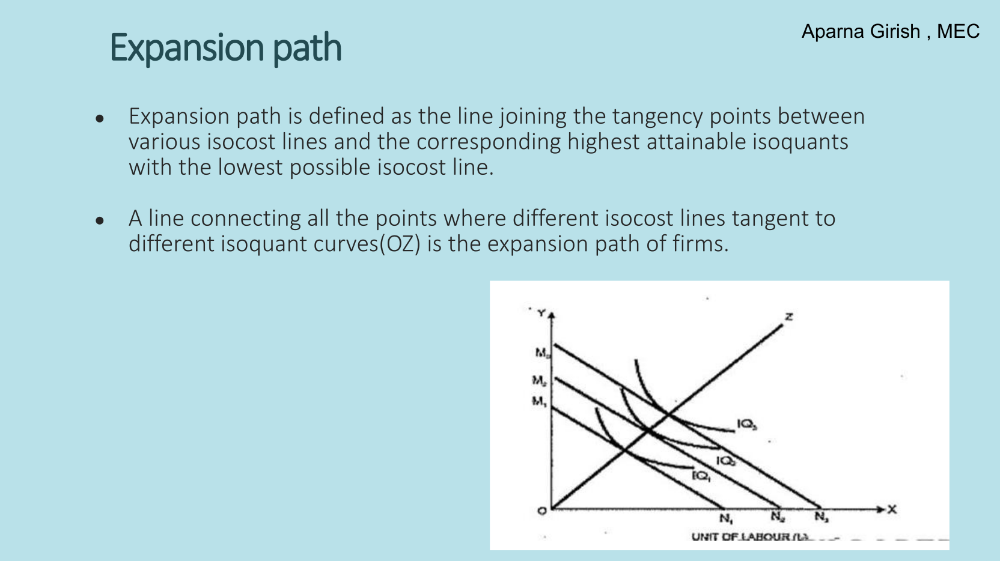
As a firm's budget grows, its isocost line shifts outward. 
* **Definition:** The expansion path is the line joining all the tangency points between the various isocost lines and their corresponding highest attainable isoquants. 
* **Function:** It illustrates the lowest possible isocost line for each level of output. A line (often denoted as $OZ$ on a graph) connecting these points traces how a firm's input mix changes as it scales operations.

---

## **Part 4: Technical Progress**

Technical progress refers to shifts in the production function over time. It occurs when a firm can produce more output with the *exact same* level of inputs, or produce the same output with a *lesser* quantity of inputs.

* **Cause:** Driven primarily by improvements in technology and sustained investment in research and development (R&D).
* **Graphical Representation:** Because fewer inputs are needed, technical progress is represented by an **inward/downward shift** of the isoquant curves toward the origin.

### **The Three Classifications of Technical Progress:**
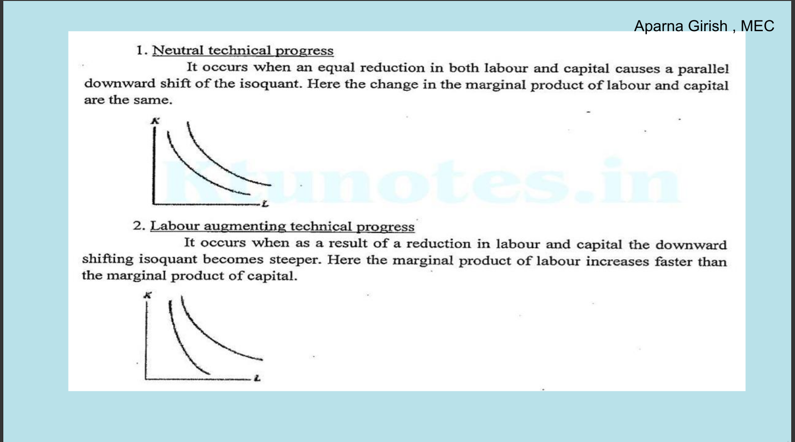
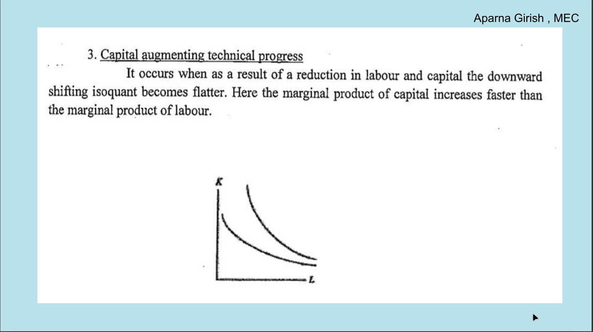

| Type of Progress | Description | Graphical Impact |
| :--- | :--- | :--- |
| **Neutral** | Occurs when an equal, proportional reduction in both labor and capital is achieved. The change in the marginal products of both labor and capital are exactly the same. | A perfectly parallel downward shift of the isoquant. |
| **Labour-Augmenting** | Occurs when technological advancements favor labor. The marginal product of labor increases at a faster rate than the marginal product of capital. | The downward-shifting isoquant becomes **steeper**. |
| **Capital-Augmenting** | Occurs when technological advancements favor capital. The marginal product of capital increases faster than the marginal product of labor. | The downward-shifting isoquant becomes **flatter**. |

---

### **7. Production Functions: The Cobb-Douglas Model**

The Cobb-Douglas production function is a foundational concept in microeconomics used to represent the relationship between the inputs used in a production process and the final output.

**Background and Origins**
* **Purpose:** It is a well-known empirical production function used widely to model how different quantities of labor and capital impact total production.
* **Creators:** The concept was initially proposed by Philip Wicksteed, but it was statistically tested and popularized by mathematician Charles W. Cobb and economist Paul H. Douglas in 1928.
* **Empirical Basis:** Their original formulation was based on real-world data taken from the US manufacturing sector spanning from 1899 to 1922. 

> **Tutor's Note on Substitutability:** The slide mentions that the function is characterized by "perfect substitutability" between labor and capital. As a point of economic accuracy, it's worth noting that a standard Cobb-Douglas function actually exhibits a *constant elasticity of substitution equal to 1*. "Perfect substitutability" technically refers to a linear production function where inputs can be swapped at a constant rate regardless of how much you already have (resulting in straight-line isoquants). Cobb-Douglas allows for substitution, but with diminishing marginal rates (resulting in curved, convex isoquants).

**The Mathematical Model**
The standard form used to model this production is:
$$Q = A K^\alpha L^\beta$$

**Variables Defined:**
* **$Q$**: Total production (output)
* **$K$**: Capital input (machinery, buildings, tools)
* **$L$**: Labor input (human effort/work hours)
* **$A$**: Technology parameter, also known as **Total Factor Productivity (TFP)**. It accounts for changes in output that aren't directly caused by changes in labor or capital (e.g., technological advancements or better management).
* **$\alpha$ (Alpha)**: The elasticity of output with respect to capital. It measures the percentage change in output resulting from a 1% change in capital.
* **$\beta$ (Beta)**: The elasticity of output with respect to labor. It measures the percentage change in output resulting from a 1% change in labor.

**Marginal Productivity**
The model is also used to determine the marginal product of each input—how much extra output is generated by adding one more unit of an input while holding the other constant. This is calculated using partial derivatives:
* **Marginal Product of Labor (MPL):** $MPL = \frac{\partial Q}{\partial L}$
* **Marginal Product of Capital (MPK):** $MPK = \frac{\partial Q}{\partial K}$

**Features: Determining Returns to Scale**
A key feature of the Cobb-Douglas production function is how easily it demonstrates returns to scale simply by looking at its exponents. The sum of the two elasticity parameters ($\alpha$ and $\beta$) reveals how the firm scales:
* **Constant Returns to Scale:** If **$(\alpha + \beta) = 1$**. (Doubling inputs exactly doubles output).
* **Increasing Returns to Scale:** If **$(\alpha + \beta) > 1$**. (Doubling inputs results in *more* than double the output—indicative of economies of scale).
* **Decreasing Returns to Scale:** If **$(\alpha + \beta) < 1$**. (Doubling inputs results in *less* than double the output—indicative of diseconomies of scale).

***

# **Economics Study Notes: Theory of Cost and Production**

## **1. Introduction to the Cost of Production**
Understanding costs is fundamental to analyzing a firm's behavior, determining supply curves, and achieving profit maximization.

* **Definition:** Cost is the total expenditure incurred by a firm in the production of a commodity.
* **Factors of Production:** Encompasses all payments or expenditures necessary to obtain the essential resources for production: **Land, Labor, Capital, and Management**.
* **Components:** Production costs include a wide variety of expenses, ranging from labor and raw materials to consumable manufacturing supplies and general overhead expenses.

> **Expanded Context:** In economics, analyzing these costs helps a firm determine the optimal level of output to maximize profit—typically the exact point where marginal cost equals marginal revenue ($MC = MR$).

---

## **2. Foundational Cost Concepts**
Economists categorize costs in several ways to analyze different types of business decisions.

### **A. Explicit vs. Implicit Costs**
* **Explicit Cost (Accounting Cost):** Direct, out-of-pocket payments made by the producer to acquire factors of production they do not personally own. These appear transparently in accounting records (e.g., worker wages, raw material purchases).
* **Implicit Cost:** Costs arising from the use of factors of production already possessed and supplied by the producer. They lack an out-of-pocket monetary value but are assigned an "imputed value" based on what they could earn elsewhere.
    * *Example:* A producer using their own building for the business or acting as Managing Director without taking a formal salary.

> **Expanded Context:** **Economic Cost** is the sum of both Explicit and Implicit costs.

### **B. Money Cost vs. Real Cost**
* **Money Cost:** The total monetary expenses paid to secure the necessary factors of production.
* **Real Cost:** A philosophical and psychological concept representing the aggregate of real productive resources absorbed. It includes the pain, effort, and sacrifice involved in production.
    * *Example:* The foregone leisure time of workers or the stress of securing investment.

### **C. Opportunity Cost & Sunk Cost**
* **Opportunity Cost:** The value of the *next best alternative* that is forgone when making a choice. It represents what is sacrificed by utilizing resources in their current way rather than an alternative way.
* **Sunk Cost:** Money that has already been spent and cannot be recovered. Crucially, sunk costs cannot be altered, increased, or decreased by varying the current level of output.
    * *Example:* Money spent on R&D for a product that fails to sell.

> **Expanded Context:** Rational economic decision-making dictates that sunk costs should be completely ignored when making future production decisions (avoiding the "sunk cost fallacy").

### **D. Private vs. Social Cost**
* **Private Cost:** The direct cost incurred strictly by the producer/agent in the production of a good (includes both explicit and implicit costs).
* **Social Cost:** The total cost that *society as a whole* bears due to production. This includes private costs plus any external costs (negative externalities) forced upon third parties.
    * *Example:* Environmental pollution and the resulting societal health costs.

---

## **3. Short-Run Cost Dynamics**

The "Short Run" is a period where **at least one factor of production is fixed** (usually capital, like factory size). Therefore, costs are split into fixed and variable categories.

### **A. Total Cost (TC)**
* **Definition:** The total overall expense incurred during the production process.
* **Behavior:** Always increases with output, as producing more inherently requires more resources.
* **Formula:** $$TC = TFC + TVC$$

### **B. Total Fixed Cost (TFC)**
* **Definition:** The cost of fixed assets.
* **Behavior:** These costs *do not change* with the volume of production. Even if output is zero, fixed costs remain stable and must be paid (e.g., rent, insurance, salaried administration).
* **Formula:** $$TFC = \text{Units of Fixed Resource} \times \text{Price of Fixed Resource}$$

### **C. Total Variable Cost (TVC)**
* **Definition:** The sum of amounts spent on all variable inputs used in production.
* **Behavior:** Varies *directly* with the level of output. When production is zero, TVC is zero (e.g., hourly wages, raw materials, manufacturing electricity).

---

## **4. Per-Unit Costs: Average and Marginal**
To understand profitability, firms must analyze costs on a strictly per-unit basis.

### **A. Average Cost (AC)**
* **Definition:** The total cost of production per single unit of a product.
* **Formulas:**
  $$AC = \frac{TC}{Q}$$
  $$AC = AFC + AVC$$

**Components of Average Cost:**
1.  **Average Fixed Cost (AFC):** Fixed cost per unit ($AFC = \frac{TFC}{Q}$). As output increases, AFC continually declines because a fixed sum is spread over more units.
2.  **Average Variable Cost (AVC):** Variable cost per unit ($AVC = \frac{TVC}{Q}$).

> **The Cost-Return Relationship:** Cost and returns are inversely related. If returns (output) increase quickly, the cost per unit goes down. If returns increase slowly or fall, the cost per unit goes up.

### **B. The U-Shape of the Average Cost Curve**

The short-term Average Cost (AC) curve is distinctly U-shaped, driven by the interaction between the AVC and AFC curves.
* **Falling Stage:** Initially, both AFC and AVC fall, causing the overall AC curve to drop sharply.
* **Leveling Stage:** Eventually, AVC begins to rise. However, because AFC is still falling steeply, the overall AC curve continues to decline (the downward pull of AFC overpowers the upward push of AVC).
* **Rising Stage:** As output increases further, a sharp rise in AVC more than offsets the continued (but slower) fall in AFC. The AC reaches its minimum point and begins to rise.

### **C. Marginal Cost (MC)**

* **Definition:** The additional cost incurred by producing *exactly one more unit* of output.
* **Mathematical Concept:** "Marginal" represents the first derivative of a "total" concept.
* **Formulas:**
  * **Discrete:** $$MC = \frac{\Delta TC}{\Delta Q} = TC_n - TC_{n-1}$$
  * **Calculus:** $$MC = \frac{d(TC)}{d(Q)}$$

**Shape & Behavior of MC:**
The MC curve is also strictly U-shaped. 
* **Cause:** Driven by the **Law of Variable Proportions** (Diminishing Marginal Returns). Initially, adding variable inputs (labor) to fixed inputs (machines) raises efficiency, dropping the marginal cost. Eventually, overcrowding occurs, diminishing returns set in, and the cost to produce one additional unit rapidly spikes upward.

***

# **Microeconomics: Cost, Revenue, and Firm Behavior**
These notes cover the fundamental relationships between production scale, costs, revenues, and decision-making for a firm.

## **1. Long-Run Cost Theory**

In economics, the "long run" is a theoretical timeframe where there are **no fixed factors of production**; a firm can adjust all its inputs (labor, capital, machinery, etc.).

* **Long-Run Total Cost (LTC):** The lowest possible cost of producing any given level of output when a firm has the flexibility to vary all of its inputs.
* **Cost Minimization:** In the long run, output can always be produced at a minimum cost because the firm has the necessary time to do two things:
    1.  Choose the ideal plant size for their target output.
    2.  Choose the least costly combination of factors of production.
* **Relationship to Short-Run Cost:** The long-run total cost will always be less than or equal to the short-run total cost ($LTC \le STC$). The short run locks the firm into certain fixed costs, whereas the long run allows for complete optimization.

---

## **2. The Long-Run Average Cost (LAC) / Envelope Curve**

The LAC curve is a vital tool for business planning and understanding long-term efficiency.

* **Definition:** The LAC curve represents the least-cost method of producing any specific output level when the firm has the ability to fully adjust all its inputs.
* **The "Planning Curve":** Entrepreneurs use the LAC curve as a planning tool to guide future expansion. It helps them select the most efficient plant size for the amount of goods they wish to produce.

### **Deriving the Envelope Curve:**
* In the long run, a firm can scale its plant size up or down.
* Each specific plant size has its own U-shaped **Short-Run Average Cost (SAC)** curve. This SAC curve reflects the production costs when that specific plant size is fixed.
* By combining the SAC curves of all possible plant sizes, we derive the LAC curve.
* The LAC is a smooth, U-shaped curve that "envelops" or touches the lowest points of the various SAC curves, which is why it is called the **Envelope Curve**.

---

## **3. Economies and Diseconomies of Scale**
The shape of the LAC curve is determined by economies and diseconomies of scale—essentially, how costs behave as a company grows.

### **Economies of Scale**

The advantages and cost efficiencies that a firm or industry gains as the scale of production expands. As the scale of production increases, the average cost per unit of output decreases.
* **Internal Economies:** Cost reductions that arise *within the firm itself* as it grows (e.g., better management structures, bulk purchasing, investing in up-to-date machinery).
* **External Economies:** Decreases in a firm's unit cost that occur because the *size of the entire industry* grows (e.g., development of better transport linkages, communication networks, or shared trade facilities in a specific region).

### **Diseconomies of Scale**
Occurs when a firm becomes too large and inefficient, causing the cost per unit of output to increase as the scale of production increases.
* **Internal Diseconomies:** Factors that raise a firm's production costs once it grows beyond a certain optimal point (often due to bureaucratic inefficiencies or communication breakdowns within a massive company).
* **External Diseconomies:** A situation where a firm's unit cost increases because the *entire industry* has grown too large (e.g., causing traffic congestion or resource scarcity).

> **Key Distinction:** "Returns to scale" explains the *technical or physical* reason for how outputs respond to inputs, whereas "economies of scale" explains the *financial cost outcome* of that physical behavior.

---

## **4. Market Dynamics: The Shut-Down Point**

A crucial short-run decision for any business operating at a loss is whether to keep the doors open or shut down immediately.

* **Definition:** The precise moment a firm experiences absolutely no financial benefit from continuing operations. It represents the minimum price required to justify staying in the market in the short run.
* **The Mathematical Condition:** A firm shuts down when the market price ($P$) falls to equal its Average Variable Cost ($AVC$).
    $$P = AVC$$
    At this point, revenue only covers variable costs (like raw materials and hourly labor).

### **The Logic of Fixed vs. Variable Costs:**
* In the short run, fixed costs (like rent or insurance) have already been incurred and must be paid regardless of whether the firm operates or not.
* By shutting down, the firm successfully avoids all variable costs, but it still loses money equal to its fixed costs.
* **Example Application:** If a firm's product price falls to **Rs. 8**, and this exactly equals its AVC, it is not covering any fixed costs. However, if the price rises to anywhere between **Rs. 8** and **Rs. 10**, the firm can pay its variable costs *and* pay off a fraction of its fixed costs. Therefore, it makes financial sense to keep operating at a loss rather than shutting down and absorbing the full blow of the fixed costs.

---

## **5. Revenue Analysis**

Revenue is the total amount of money a firm brings in from selling its goods and services over a specific period.

* **Total Revenue (TR):** The overall income from sales.
    $$TR = P \times Q$$
* **Average Revenue (AR):** The revenue earned per unit of a commodity sold. Note that Average Revenue is generally equal to the Price of the good.
    $$AR = \frac{TR}{Q}$$
* **Marginal Revenue (MR):** The additional revenue gained from selling exactly one more unit of a commodity.
    * **Discrete:** $$MR = TR_n - TR_{n-1}$$
    * **Calculus:** $$MR = \frac{d(TR)}{dQ}$$

### **The AR & MR Relationship:**
* To sell larger quantities, a firm usually has to lower its prices. As a result, both AR (price) and MR decline as output increases.
* Because the price cut applies to all units sold, the fall in MR is steeper than the fall in AR. Therefore, the MR curve always lies below the AR curve on a graph.
* **Exception:** In a perfectly competitive market where a firm can sell all it wants at a constant price, the MR remains constant and perfectly coincides with the AR.

---

## **6. Break-Even Analysis**

Break-even analysis examines the relationship between total costs, total revenue, and overall profit or loss across different levels of output.

* **The Break-Even Condition:** A firm breaks even (earns zero economic profit) when Total Revenue equals Total Cost.
    $$TR = TC$$

### **Non-Linear Analysis (Real-World Complexity)**
* Because costs and revenues often curve due to changing efficiencies and market prices, there are usually two break-even output levels ($Y_1$ and $Y_3$).
* If output is below $Y_1$ or above $Y_3$, the firm suffers losses ($TR < TC$).
* Between output levels $Y_1$ and $Y_3$, the firm generates a profit ($TR > TC$).
* Profit is perfectly maximized at output $Y_2$, the point where the vertical distance between the TR curve and TC curve is at its absolute widest.

### **Linear Analysis (Simplified Model)**
* Assuming a firm charges a constant selling price ($P$) per unit, TR becomes a straight, upward-sloping line.
* The Total Cost equation is $$TC = F + v \times Q$$ *(where $F$ is Fixed Cost, $v$ is variable cost per unit, and $Q$ is volume).*
* To find the exact break-even quantity in units, set $TR = TC$:
    $$P \times Q = F + v \times Q$$
* Solving for $Q$ gives the formula:
    $$Q = \frac{F}{P - v}$$