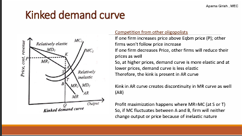

# Comprehensive Notes: Market Structures

---

## 1. Introduction to Markets

* **Definition:** A market is an environment where producers and consumers interact to exchange a good or a service.
* **Classification:** Based on the level of competition, market structures are divided into two main categories: Perfect Competition and Imperfect Competition. Imperfect Competition is further divided into: Monopoly, Monopolistic Competition, and Oligopoly.
* **Universal Rule:** Under any market condition, the Average Revenue (AR) curve is always the same as the demand curve.

---

## 2. Perfect Competition

Perfect competition is an ideal market situation characterized by a complete absence of rivalry among individual firms. Because there is a perfect degree of competition, a single price prevails across the market.

**Example:** The market for agricultural products is considered a close example.

### Key Features
* **Homogenous Product:** All firms sell an identical product.
* **Market Participants:** There is a large number of buyers and a large number of sellers.
* **Information & Behavior:** Participants have full knowledge of the market and exhibit economic rationality.
* **Barriers:** There is free entry and exit for firms.
* **Pricing Power:** Individual firms are "price takers," meaning they have no control over the market price.

### Price and Output Determination

* **Industry vs. Firm:** The price is determined by the combined forces of demand and supply of the entire industry.
* **Demand Curve:** For an individual firm, the demand curve (which equals AR and MR) is perfectly elastic. It is represented as a horizontal straight line parallel to the x-axis. This occurs because a seller can sell any quantity at the prevailing market price.
* **Pricing Consequences:** If a firm sets any price above the market rate, they will lose their customers; if they set it below, they will face a loss.
* **Firm Equilibrium:** A firm maximizes its profit and reaches equilibrium when Marginal Cost (MC) equals Marginal Revenue (MR), provided that the MC curve is rising at that point.

### Profit Conditions
* **Short Run:** Firms can experience supernormal profit, normal profit, or a loss.
* **Long Run:** In the long run, firms can only achieve a normal profit. At this stage, Total Revenue (TR) equals Total Cost (TC), and the AR curve is tangent to the Average Cost (AC) curve.

---

## 3. Monopolistic Competition

In this market, each seller produces a differentiated product, but these products have close substitutes.

### Key Features
* **Market Participants:** There is a large number of buyers and sellers.
* **Product:** Characterized by product differentiation.
* **Barriers:** There is freedom of entry and exit for firms.
* **Pricing Power:** Firms are neither purely price makers nor price takers.
* **Information & Marketing:** There is a lack of perfect knowledge among participants, and firms heavily engage in advertisements and promotional activities.
* **Demand Curve:** The demand curve is highly elastic because more goods can only be sold at a lower price.

### Price and Output Determination
* **Equilibrium:** Just like in perfect competition, profit is maximized where MC = MR.
* **Profit Calculation:** Profit per unit is calculated as AR minus AC. Total profit equals the profit per unit multiplied by the total output.
* **Long-Run Profit:** Firms will eventually only earn a normal profit. This is because making a supernormal profit in the short run attracts new firms to enter the market, which increases competition and has a depressing effect on prices.

---

## 4. Monopoly

A monopoly occurs when a single seller controls the entire supply of a commodity.

### Key Features
* **Market Participants:** There is a single seller but an ample number of buyers.
* **Product:** The product has no close substitutes.
* **Barriers:** There are heavy restrictions on the entry of new firms.
* **Pricing Power:** The seller is a "price maker" with full control over the price. There is also the possibility of price discrimination.
* **Information:** There is a lack of perfect knowledge in the market.

### Price and Output Determination
The fundamental process of price-output determination is the same as under monopolistic competition.

* **Demand Curve Differences:** While both monopoly and monopolistic competition feature a downward-sloping demand curve, the key difference lies in the slope or elasticity. A monopoly's demand curve is less elastic (steeper) because their product has no close substitutes in the market.

> **Note:** The provided materials also briefly mention that analyzing a monopoly includes studying the types of monopoly, regulation, and its advantages/disadvantages, though specific details on these were not provided.

---

## 5. Oligopoly

An oligopoly features a few sellers who sell either a homogenous or a differentiated product.

**Examples:** The aviation and telecom industries are standard examples.

### Key Features
* **Market Participants:** There are only a few sellers.
* **Product:** Goods can be homogenous or differentiated.
* **Barriers:** There are significant barriers to entry.
* **Interdependence:** There is strong mutual interdependence among firms; the price-output decisions of one firm are highly dependent on the actions of the others.

### Operational Models
* **CARTEL Model:** This involves formal and overt agreements among firms regarding price-output decision-making (e.g., OPEC).
* **COLLUSION Model:** This involves an informal and covert agreement among firms.

### Price and Output Determination Under a Cartel
* **Industry Equilibrium:** For the cartel as a whole, the Combined Marginal Cost (CMC) curve is found by horizontally adding the individual MCs of the firms. Equilibrium (and profit maximization) is established where the CMC intersects the MR curve. This point determines the total output of the industry and the set price.
* **Individual Firms:** A firm's specific output is determined by taking a horizontal projection from the industry's equilibrium point to the firm's individual MC curve, and then projecting vertically down to the x-axis. The price for the firm matches the horizontal projection from the industry's AR curve.
* **Profit Distribution:** Total cartel profits are divided among the firms based on their agreed-upon output share.
* **Cartel Failure:** If all firms within the agreement cheat, the cartel will fail, causing profits to fall back to competitive levels.

## 1. Oligopoly & The Kinked Demand Curve

The kinked demand curve theory explains price rigidity in an oligopoly market based on the reactions of rival firms.

### Mechanics of the Kinked Demand Curve:
* **Price Increases:** If one firm increases its price above the equilibrium price ($P$), other competing firms will not follow the price increase. Therefore, at higher prices, the demand curve (AR curve) is relatively elastic.
* **Price Decreases:** If one firm decreases its price, other firms will quickly reduce their prices as well to avoid losing market share. Consequently, at lower prices, the demand curve is relatively inelastic.
* **The "Kink" and Discontinuity:** This asymmetrical reaction creates a visible "kink" in the Average Revenue (AR) or demand curve at the prevailing price level. The kink in the AR curve causes a vertical discontinuity or gap (labeled AB) in the Marginal Revenue (MR) curve.
* **Profit Maximization:** A firm maximizes profit where Marginal Revenue equals Marginal Cost ($MR=MC$). Because of the discontinuous gap in the MR curve, the Marginal Cost (MC) curve can fluctuate between points A and B without causing the firm to change its output or price, explaining price stability in this market.

### Drawbacks of the Kinked Demand Theory:
This model is often considered an incomplete theory of oligopoly for several reasons:
* It fails to explain how the oligopolist actually finds the initial "kinked point" or equilibrium price on its market demand curve.
* It does not account for the possibility that rival firms might match a price increase, a practice that is frequently observed in the real world.
* The theory ignores situations where other oligopolists consistently follow the pricing decisions of a single firm (like a price leader) when they raise prices.

---

## 2. Perfect Competition

### Advantages:
* **Lowest Possible Prices:** Because the market consists of many small firms producing relatively small amounts, product prices are kept as low as possible.
* **Efficiency:** Resources in this market structure are allocated in the most efficient way.
* **Standardization:** Consumers have access to standard, homogeneous products.
* **No Advertising Costs:** Promotional and advertising expenses are entirely eliminated because all products are identical and consumers possess perfect knowledge of the market.
* **Wealth Distribution:** This structure prevents the emergence of a small group of rich and powerful individuals dominating the market.

### Disadvantages:
* **Lack of R&D:** Firms are simply too small to fund large-scale research and development for new technologies.
* **No Consumer Choice:** Undifferentiated, homogeneous products give consumers very little choice, which is a significant drawback in industries where differentiation matters (like cars or clothing).
* **High Vulnerability:** There are very few barriers to entry, meaning any new firm can easily enter the market and begin selling the product, increasing immediate competition.

---

## 3. Monopolistic Competition

### Advantages:
* **No Monopoly Power:** A lack of barriers to entry (and exit) makes it relatively easy for firms to join the market, ensuring no single firm can establish monopoly power.
* **Variety and Choice:** To survive, a firm's primary goal is to differentiate its product from rival competitors. This differentiation provides consumers with a much greater variety of products and services to choose from.
* **Quality Improvement:** Firms continuously strive to improve their product and service quality as a means to gain an economic profit.
* **Informed Consumers:** Because firms use marketing and advertising to differentiate themselves, consumers become highly knowledgeable and informed about their various product options.

### Disadvantages:
* **Wasteful Production:** Firms in this market often do not produce enough output to efficiently lower their average costs, meaning they fail to benefit from economies of scale.
* **Higher Prices:** Because firms have "some market power" through product differentiation, they are able to sell their goods at higher prices than in perfectly competitive markets.
* **Excessive Advertising:** Companies tend to spend heavily on advertising, which can be wasteful and, in many cases, may mislead consumers.

---

## 4. Monopoly

### Types of Monopolies:
* **Natural Monopoly:** Arises from limited supplies of raw materials in specific geographical regions (e.g., India and Pakistan's historical monopoly on jute, or South Africa's monopoly on diamonds).
* **Social Monopoly:** Enterprises generally owned and managed by the State, such as railways, harbors, and the central bank.
* **Legal Monopoly:** Firms given legal protection by the State through mechanisms like patents and trademarks.
* **Monopoly of Services:** Occurs when a single individual possesses a highly unique skill set (e.g., being the only surgeon in a city capable of performing a complex operation).

### Advantages:
* **Economies of Scale:** A monopoly firm enjoys the benefits of large-scale production and eliminates wasteful competition.
* **Efficiency in Utilities:** For certain necessities like water and electricity, competing supply lines would be wasteful and result in higher consumer prices, making a monopoly more efficient.
* **Cost Reduction:** A reduction in the number of retail shops or product varieties (e.g., fewer car models) can significantly reduce the overall cost of production and distribution. (Note: This comes at the cost of consumer choice).

### Disadvantages:
* **Higher Prices:** Prices are normally higher under a monopoly than they are under competitive market conditions.
* **Unfair Tactics:** Monopolists frequently adopt unfair methods and practices to eliminate potential competitors.
* **Wealth Concentration:** Monopolies result in wealth being concentrated in the hands of a few people, which can negatively affect the smooth functioning of a democracy.
* **Stifled Economic Growth:** Because competition is a necessary condition for economic growth, the complete lack of competition in a monopoly acts as a check or hindrance on economic progress.
* **Labor Exploitation:** A monopoly firm may exploit its labor force by paying low wages, as workers have limited alternative employment options in that industry.

# College Notes: Product Pricing & Strategies

---

## 1. Market Demand Curves

* **Monopoly vs. Monopolistic Competition:** The demand curves (Average Revenue or AR curves) behave differently depending on the market structure.
    * In a monopoly, the AR curve is steeper.
    * In monopolistic competition, the AR curve is relatively flatter, reflecting a different relationship between revenue and output.

---

## 2. Introduction to Product Pricing

* **The "Right" Price:** The ideal price for a product is one that satisfies all market participants, including consumers, sellers, and shareholders.
* **Need for Review:** Any change in the determinants of demand for a product requires the firm to review its pricing policy.

---

## 3. Factors Influencing Pricing Decisions

Before deciding on a pricing strategy, a firm must consider several critical factors:
* **Market Dynamics:** The degree of competition in the market and the price of competitors' products.
* **Consumer Factors:** The buying capacity of the consumers.
* **Firm's Objectives:** Whether the firm aims for profit maximization or sales maximization necessitates different pricing approaches.
* **Cost of the Product:** This is the most crucial factor; any change in the product's cost should result in a change in its price.
* **Government Policy:** Taxation and subsidy policies set by the government strongly influence pricing decisions.

---

## 4. Important Pricing Strategies

### A. Cost Plus or Markup Pricing
* **Definition:** The price is determined by taking the sum of the cost and an added profit margin.
* **Alternate Names:** Because the average cost is typically used, it is also known as Average Cost Pricing or Full Cost Pricing.
* **Formula:** $\text{Price} = AC + m$ (where $AC$ is Average Cost and $m$ is the percentage of markup).
* **Characteristics:** The markup is often fixed arbitrarily (frequently at **10%**), though it can vary across industries or firms based on competition and available substitutes. It is a simple and convenient method.
* **Limitation:** It is unsuitable when a market features tough competition or the threat of new firms entering.

### B. Target Return Pricing
* **Definition:** Similar to cost-plus pricing, but instead of an arbitrary margin, the producer rationally calculates and sets a minimum rate of return.
* **Determination:** The margin is decided based on the firm's experience, the consumer's paying capacity, associated risks, and other factors.

### C. Penetration Pricing
* **Definition:** A strategy used to enter an already dominated market by setting a price lower than the existing market price.
* **Example:** Reliance successfully adopted this strategy to enter the mobile phone industry.
* **Application:** It is usually adopted on a short-term basis, and its success relies heavily on the price elasticity of demand.

### D. Predatory Pricing
* **Definition:** An already dominant firm (the predator) sets its prices extremely low for a sufficient period to drive competitors out of the market and deter new entrants.
* **Rationale:** The firm expects that present losses (or foregone profits) will be compensated by large future gains once it acquires exploitable market power in the post-predatory period.
* **Impact:** This strategy is anti-competitive, harms consumers, and violates competition laws by making markets vulnerable to monopolies.

### E. Going Rate Pricing
* **Definition:** Following the prevailing market price rather than establishing a separate, unique pricing strategy.
* **Mechanism:** Typically, a dominant firm sets the price, and other firms accept it. By adopting this, firms can avoid price wars.
* **When it is used:**
    * When products are very close substitutes with high cross elasticity (e.g., packaged drinking water).
    * When new firms are unsure if demand will shift in their favor.
    * When a product reaches maturity and becomes generic (e.g., buyers asking for "mineral water" rather than a specific brand).

### F. Price Skimming
* **Definition:** Charging a very high price when a product is introduced, and then lowering the price during the product's maturity phase.
* **Target Audience:** High-income consumers who want to be the first to possess a product, often using it as a status symbol rather than for its intrinsic value.
* **Lifecycle:** Initially, the firm "skims" the market to earn exceptionally high profits. Once the product is established and matures, the firm reduces the profit margin and price to attract lower-income groups.

### G. Administered Pricing
* **General Definition:** Usually denotes the price charged by monopolists who act as "price makers" rather than relying on market mechanisms to fix prices.
* **Indian Context:** In India, this term specifically refers to prices that are statutorily fixed by the government.
* **Application:** The government fixes these prices for certain essential commodities in the interest of society (e.g., the price of cooking gas).