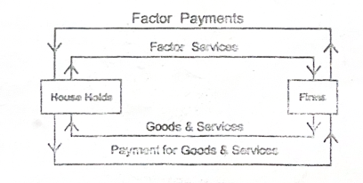
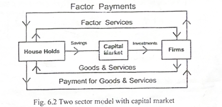
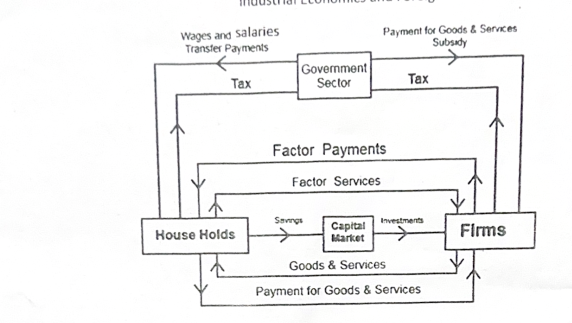
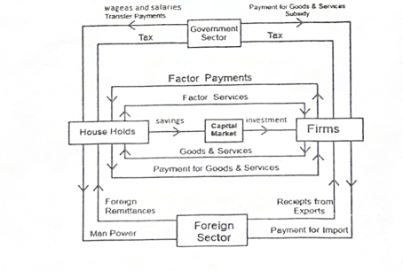

***

# Chapter 6: National Income

## 6.1 The Circular Flow of Income

Economic transactions generate two primary types of flows that move in opposite directions in a circular manner:

*   **Product Flow (Real Flow):** The flow of goods, services, and factor services.
*   **Money Flow:** Consists of income and expenditure flows.
    *   *Income Flow:* Factors of production supply their services and receive factor incomes in return.
    *   *Expenditure Flow:* The income earned is spent on purchasing various goods and services.

To illustrate these flows, an economy is divided into four distinct sectors: **Household**, **Business (Firms)**, **Government**, and **Foreign**.

### Models of Circular Flow

#### 1. Circular Flow in a Two-Sector Model

The simplest model consisting only of Households and Firms. It represents a **factor market** (flow of factor services and payments) and a **commodity market** (flow of goods/services and their payments).

*   **Households:** Possess all factors of production. They supply factor services to firms, receive factor payments (rent, interest, wages, and profit), and spend this income buying goods and services from firms.
*   **Firms:** Hire factor services to produce goods and services, which they then sell back to households.
*   **Key Assumption:** Households spend their entire income on goods and services.
*   **Core Identity:** 
    > $Y \equiv FP \equiv V$ 
    *(Where Y = household income, FP = factor payments, V = money value of output)*

#### 2. Two-Sector Model with Capital Market

Introduces savings and investments into the two-sector model.

*   **Leakage (Savings):** Households may save a portion of their income rather than spending it entirely. This unspent income acts as a leakage and enters the capital market.
*   **Injection (Investments):** Firms borrow these savings from the capital market to invest. Investment acts as an additional expenditure and injects money back into the economy.
*   **Equilibrium Requirement:** The economy functions smoothly when **Total Savings = Total Investment**.

#### 3. Three-Sector Model

Introduces the **Government Sector** to the households and firms.

*   **Leakages:** Both households and firms pay *taxes* to the government, acting as a leakage from the income stream.
*   **Injections:** *Government expenditure* acts as an injection (e.g., payments to firms for goods/services/subsidies; wages, salaries, and welfare transfer payments to households).
*   **Budget Impacts on the Flow:**
    *   *Balanced Budget:* Gov. Expenditure = Taxes (No disturbance to circular flow).
    *   *Surplus Budget:* Gov. Expenditure < Taxes (Leakage occurs, reducing the size of the circular flow).
    *   *Deficit Budget:* Gov. Expenditure > Taxes (Injection occurs, expanding the circular flow).

#### 4. Four-Sector Model

Introduces the **Foreign Sector**, representing international trade.

*   **Households:** Export manpower to the foreign sector $\rightarrow$ receive foreign remittances in return.
*   **Firms:** 
    *   *Exports (Injection):* Sell goods and services to the foreign sector $\rightarrow$ receive export receipts.
    *   *Imports (Leakage):* Buy raw materials and inputs from the foreign sector $\rightarrow$ make payments for them.

***

## 6.2 Concepts of National Income

### Key Distinctions in National Income Accounting

| Concept | Description | Inclusion in National Income | Examples |
| :--- | :--- | :--- | :--- |
| **Factor Income** | Income received in return for supplying a factor service. Results in the production of a product/service. | **Included** | Rent, interest, wages, profit. |
| **Transfer Income** | Unilateral/one-sided payments that do not add to the current flow of goods and services. | **Excluded** | Charity donations, unemployment allowances, pensions, gifts, compulsory transfers (taxes). |

| Concept | Description | Inclusion in National Income | Examples |
| :--- | :--- | :--- | :--- |
| **Intermediate Goods** | Goods used as inputs in the production of other goods. They require further processing. | **Excluded** | Raw materials, fuel, electricity. |
| **Final Goods** | Finished products ready for consumption or investment without needing further processing. | **Included** | Clothing, vehicles, machinery. |

| Concept | Description | Key Characteristic | Examples |
| :--- | :--- | :--- | :--- |
| **Consumer Goods** | Goods utilized directly for consumption purposes. | Can be durable, semi-durable, or non-durable. | TVs, fridges, clothes, food items. |
| **Capital Goods** | Goods utilized for investment to produce other goods and services. | A country's economic growth is dependent on its stock of these goods. | Machinery, buildings, equipment. |

### Defining National Income

National income can be viewed from two primary perspectives:

1.  **From the Income Side:** The sum total of all factor incomes (rent, interest, wages, and profit) received by the residents of a country over a period of one year.
2.  **From the Output Side:** The total money value of all final goods and services produced in an economy during an accounting year.

***

# Economics: National Income

## 1. Core Concepts and Terminology

*   **National Income (NI):** The money value of the total goods and services produced in a country during a financial year. It represents the total income of a nation.
*   **Measurement Authority:** In India, the Central Statistical Organization (CSO) is responsible for national income accounting.

| Concept | Description | Examples |
| :--- | :--- | :--- |
| **Factor Income** | Income received for supplying a factor service. | Rent, interest, wages. |
| **Transfer Payments** | Unilateral/one-sided payments where nothing is produced in return. | Charity donations, old-age pensions, gifts. |

---

## 2. Classification of Goods

| Type of Good | Description | Examples |
| :--- | :--- | :--- |
| **Intermediate Goods** | Goods used for the production of other goods and services that pass through different stages. | Raw materials, fuel. |
| **Final Goods** | Goods completely ready for consumption or investment. | Clothing, machinery. |
| **Consumer Goods** | Goods used strictly for consumption purposes (durable, semi-durable, or non-durable). | TVs, shoes, food. |
| **Capital Goods** | Goods used to produce other goods and services. | Machinery, equipment, buildings. |

---

## 3. Key Aggregates and Formulas

*   **Gross Domestic Product at Market Price ($GDP_{mp}$):** The market value or money value of all final goods and services produced within the domestic territory of an economy during a financial year.
*   **Gross National Product (GNP):** The market value of all final goods and services produced plus the net factor income from abroad (NFIA). 
    *   $GNP = GDP + NFIA$
*   **Net Domestic Product at Market Price ($NDP_{mp}$):** The market value of final goods and services after deducting depreciation (the fall in value of capital due to wear and tear). 
    *   $NDP_{mp} = GDP_{mp} - \text{Depreciation}$
*   **Net National Product at Market Price ($NNP_{mp}$):** 
    *   $NNP_{mp} = NDP_{mp} + NFIA$

### Market Price (MP) vs. Factor Cost (FC)
Market price is the amount paid by the buyer in the market, while factor cost is the amount paid by the producer to the factors of production.

*   $MP = \text{Cost of production} + \text{Indirect taxes} - \text{Subsidies}$
*   $FC = \text{Cost of production} - \text{Indirect taxes} + \text{Subsidies}$
*   **Net Indirect Tax (NIT):** Indirect Tax minus Subsidy.
*   $NNP_{fc} = NNP_{mp} - NIT$

> **Easy Rules to Remember:**
> *   **Net** = Gross - Depreciation
> *   **National** = Domestic + NFIA
> *   **Factor Cost** = Market Price - Net Indirect Tax

---

## 4. Other Income Measurements

*   **Private Income:** The income of non-governmental entities from all sources over a period of one accounting year. ($NNP_{fc}$ minus domestic product accruing to the government + transfer payments + interest on public debt).
*   **Personal Income (PI):** The sum of all income actually received by households and individuals from different sources before paying direct taxes. (National Income minus corporate tax, undistributed corporate profits, and social security contributions + transfer payments and interest on public debt).
*   **Personal Disposable Income (DPI):** The portion of personal income left for consumption and saving after paying direct taxes. 
    *   $DPI = \text{Personal Income} - \text{Direct Taxes}$
*   **Per Capita Income (PCI):** The per-person average national income. 
    *   $PCI = \frac{NI}{\text{Population}}$

---

## 5. Constant vs. Current Prices & Sectors

*   **Current Prices (Nominal National Income):** National income estimated according to the prices of goods and services prevailing in the *current* year.
*   **Constant Prices (Real National Income):** National income estimated according to the prices of goods and services prevailing in a chosen *base* year (Base year for India is 2011-12). An increase here indicates true economic growth or increased output.

### Three Sectors of the Economy
1.  **Primary Sector:** Activities related to natural resource exploitation (agriculture, mining, forestry, fishing).
2.  **Secondary Sector:** The manufacturing sector (registered and unregistered manufacturing).
3.  **Tertiary Sector:** Service providers (health, education, banking, transport, trade).

---

## 6. Methods for Estimating National Income

### I. Output / Production / Value Added Method
Estimates $GDP_{mp}$ by summing the money value of final output produced by all three sectors in the domestic territory.
*   **Step 1:** Find Gross Value Added at market price: $GVA_{mp} = \text{Gross value of output} - \text{Intermediate consumption}$
*   **Step 2:** Sum the $GVA_{mp}$ of all sectors to get $GDP_{mp}$.
*   **Step 3:** Derive $NNP_{fc}$ (National Income) by adding NFIA and adjusting for depreciation and NIT.

### II. Income Method
Obtained by adding up the factor incomes of all individuals and business enterprises.
*   **Components:** Rent (land), Wages (labour), Interest (capital), Profit (entrepreneur), and mixed income of the self-employed. *(Note: Rent + Interest + Profit = Operating Surplus)*.
*   **Step 1:** Estimate factor incomes. Their sum equals $NDP_{fc}$.
*   **Step 2:** Add NFIA to calculate National Income ($NNP_{fc}$).

### III. Expenditure / Consumption-Saving Method
Estimates $GDP_{mp}$ by adding all final expenditures made on goods and services during the year.
*   **Components:** Consumption expenditure by households ($C$), Investment expenditure by firms ($I$), Government expenditure ($G$), and Net Exports ($X-M$ or $NX$).
*   **Formula:** $GDP_{mp} = C + I + G + (X - M)$
*   **Step 1:** Calculate $GDP_{mp}$.
*   **Step 2:** Derive $NNP_{fc}$ (National Income).

---

## 7. Exclusions and Significance

**Items Excluded from National Income:**
*   Buying and selling of shares/securities (purely financial, nothing produced).
*   Value of intermediate goods used.
*   Lottery prize money.
*   All transfer payments.
*   Sale of second-hand goods (only counted when first purchased).
*   Illegal income (smuggling, gambling, black money).

**Significance of National Income:**
*   Evaluates the economy's performance over the years.
*   Helps formulate economic policies and planning.
*   Identifies sector contributions to the economy.
*   Allows comparison of economic performance between countries.
*   Measures inequalities in income distribution.

---

## 8. Difficulties in Measurement

Measurement challenges are generally divided into two main categories:

### Conceptual Difficulties (Common globally)
*   **Unremunerated Services:** Unpaid services (like those of a homemaker) are excluded, whereas a paid domestic worker's services are included.
*   **Classifying Goods:** The same product can be both final and intermediate (e.g., milk is final for households but intermediate for hotels).
*   **Government Output:** Difficult to estimate the value of output in the government sector since public goods are provided free or at nominal prices.
*   **Double Counting:** The persistent problem of counting the value of a good multiple times across production stages.

### Practical / Statistical Difficulties (Mainly in developing countries)
*   **Data Issues:** Inadequacy, non-availability, and lack of accurate statistical data.
*   **Illiteracy:** Many producers/farmers do not keep proper accounts of production.
*   **Lack of Occupational Specialisation:** Unskilled people earn income from multiple simultaneous occupations, making it hard to compute.
*   **Self-Consumption:** A major part of agricultural output is consumed by the farmers themselves, making its value difficult to estimate.
*   **Non-Monetised Sector:** Heavy reliance on barter transactions in rural areas. Price changes and black money also pose severe challenges.

***

# Module 3: Inflation
**Instructor:** Aparna Girish, MEC

## 1. Core Concept and Definition

> **Definition:** Inflation is the rise in the general level of prices of goods and services in an economy over a period of time. 
> 
> **Classic Phrase:** *"Too much money chasing too few goods."*

*   **Value of Money:** The value of money is inversely proportional to the price level. 
    *   $\text{Value of money} = \frac{1}{\text{Price level}}$

---

## 2. The Inflationary Spiral (Disequilibrium)

Inflation creates a cycle of disequilibrium that starts when aggregate demand exceeds supply. This triggers a chain reaction:

1.  **Price Rise:** The initial excess demand causes prices to go up.
2.  **Reduced Consumption:** This price rise reduces the rate of consumption for wage earners.
3.  **Demand for Higher Wages:** To cope with the rising cost of living, wage earners demand a higher wage rate.
4.  **Increased Production Costs:** Higher wages lead to an increase in the cost of production for businesses.
5.  **Further Price Hikes:** Producers raise prices again to compensate for their higher production costs.
6.  **"Inflationary Fire":** This creates an ongoing cycle, continuously increasing the cost of living.

---

## 3. Types of Inflation

Inflation can be categorized in two primary ways:

### A. Based on the Rate
| Type | Inflation Rate |
| :--- | :--- |
| **Creeping Inflation** | Less than 3% |
| **Walking Inflation** | 3% to 10% |
| **Running Inflation** | 10% to 20% |
| **Galloping / Hyperinflation** | 20% to 100%+ |

### B. Based on the Cause
| Type | Description |
| :--- | :--- |
| **Demand-Pull** | Driven by an increase in aggregate demand. |
| **Cost-Push** | Driven by an increase in production costs (wages, raw materials). |
| **Sectoral Inflation** | Localized to specific sectors of the economy. |

---

## 4. Causes of Inflation

The primary drivers of inflation are broken down into demand-side and supply-side factors:

| Demand-Side Causes (Increases Demand) | Supply-Side Causes (Restricts Supply) |
| :--- | :--- |
| • Increase in the overall money supply. | • Shortage of capital and complementary production factors. |
| • Increase in consumers' disposable income. | • Increase in wages (leading to higher production costs). |
| • Changes in consumer spending habits (e.g., easy credit). | • Hoarding, which creates artificial scarcity. |
| • Increased government expenditure. | • Natural calamities disrupting production/supply chains. |
| • Deficit financing by the government. | • Increase in exports, leaving fewer goods for the domestic market. |
| • Implementing a cheap money policy (low interest rates). | • The law of diminishing returns. |
| • Increase in population. | • International trade relations negatively impacting supply. |
| • Presence of black money in the economy. | |

---

## 5. Effects of Inflation

Inflation has widespread, complex impacts across the economy:
*   **Wealth Distribution:** It alters the distribution of income and wealth.
*   **Debtors vs. Creditors:** Debtors generally benefit (paying back loans with "cheaper" money), while creditors lose purchasing power.
*   **Investment & Production:** It affects investment and production due to fluctuations in savings.
*   **Socio-Political Impact:** It creates social and political instability, often leading to negative market practices like hoarding, black marketing, and product adulteration.

---

## 6. Measures to Control Inflation

There are three primary ways to control inflation: monetary policy, fiscal policy, and other measures.

### A. Monetary Policy Measures (Central Bank)
These measures are adopted by a country's central bank to manage credit and money supply.

* **Quantitative Credit Control:** Regulates the overall volume of bank credit regardless of its purpose.
    * **Bank Rate Policy:** The rate the central bank uses to rediscount approved bills of exchange and commercial papers. During inflation, the central bank raises this rate (dear money policy), which increases borrowing costs, reduces money flow to the public, and lowers aggregate demand.
    * **Cash Reserve Ratio (CRR):** A mandatory percentage of total deposits commercial banks must keep as a cash reserve with the central bank. Increasing CRR reduces cash availability and lending capacity during inflation.
    * **Statutory Liquidity Ratio (SLR):** A mandatory percentage of deposits kept within the commercial bank itself as safe, liquid assets like cash, gold, or unencumbered government securities. Increasing SLR decreases bank credit and ensures bank solvency.
    * **Open Market Operations:** The central bank's sale and purchase of government securities. During inflation, securities are sold to the public, transferring bank deposits to the central bank and reducing banks' credit creation capacity.

* **Qualitative/Selective Credit Control:** Directs credit toward essential purposes while discouraging non-essential uses.
    * **Margin Requirements:** Regulating the margin, which is the difference between a security's market value and the loan amount granted against it. 
    * **Regulation of Consumer Credit:** Laying down terms for consumer credit, such as restricting loan amounts, limiting repayment times, and fixing down payments.
    * **Moral Suasion:** Informal requests, periodical letters, and discussions from the central bank asking commercial banks to contract credit during inflation.
    * **Direct Action:** Taking direct action against erring banks, such as canceling licenses or refusing to rediscount bills.

### B. Fiscal Policy Measures (Government)
These are government measures aimed at controlling the aggregate demand in the economy.

* **Public Revenue (Tax):** Taxes are the main source of public revenue. Direct taxes are increased to reduce the public's disposable income and limit total spending.
* **Public Expenditure:** The government cuts spending on welfare programs and developmental activities to decrease private income and overall aggregate demand.
* **Public Borrowing:** The government borrows more money from the public while simultaneously delaying the repayment of existing public debt.

### C. Other Measures
Direct interventions by the government to manage supply, prices, and costs.

* **Increasing the Supply of Goods:** Encouraging domestic production of essential commodities, importing essential products, and banning the export of such items.
* **Price Control:** Using direct measures, like the public distribution system, to sell essential commodities at reduced prices.
* **Wage Control:** Preventing wage escalation to specifically target and control cost-push inflation.

---

## 7. Repo and Reverse Repo Rates

These are specific tools used by the Reserve Bank of India (RBI) to manage liquidity in the economy:

*   **Repo Rate:** The rate at which the RBI provides overnight liquidity (loans) to commercial banks against the collateral of government and other approved securities.
*   **Reverse Repo Rate:** The rate at which the RBI absorbs liquidity on an overnight basis from commercial banks. Commercial banks deposit their excess funds in the RBI to earn interest.

> **Important Correction/Note for Real-World Application:** 
> *The original slides mention that the "Repo rate is always less than reverse repo rate." For the sake of your real-world economic knowledge, it is worth noting that this is a misconception. In actual central banking practice, the **Repo rate** (the rate the RBI charges to lend money) is generally **higher** than the **Reverse Repo rate** (the rate the RBI pays to borrow money).*

***

# Business Financing

> **Definition:** Business finance refers to the funds acquired by business owners to meet various operational and structural needs.

**Primary Uses for Funds:**
*   Commencing a new business venture.
*   Obtaining top-up funds to finance day-to-day business operations (working capital).
*   Purchasing capital assets for the business (machinery, property, etc.).
*   Dealing with sudden cash crunches or emergencies.

---

## 1. Sources of Capital

Businesses can raise capital through several avenues, categorized by their source and term length:

*   **Internal Self-Finance:** An important source of capital that comes directly from the retained earnings or savings of the business unit itself.
*   **Public Deposits:** Mostly used for short-term financing. People deposit their money with companies for periods typically ranging from 6 months to 2 years. Depositors receive a fixed interest rate, and companies use these funds to meet operational expenses.
*   **Loans from Banks:** Commercial banks provide funds specifically to meet short-term needs for working capital.
*   **Indigenous Bankers:** Private money lenders or informal banks that typically charge a heavy rate of interest.
*   **Development Finance Institutions (DFIs):** Specialized institutions that cater to the broader, long-term financial needs of both large and small industries.

---

## 2. Financial Instruments: Bonds vs. Shares

Understanding the difference between debt (bonds) and equity (shares) is crucial for both investors and businesses seeking capital.

| Feature | Bonds (Debt) | Shares (Equity) |
| :--- | :--- | :--- |
| **Ownership Status** | The investor *lends* money to the company. | The investor *owns* a part of the company. |
| **Risk Level** | Risk is low. | High risk. |
| **Issuers** | Issued by Government Institutions, Financial institutions, and Corporate enterprises. | Issued exclusively by Corporate enterprises. |
| **Type of Return** | Bondholders receive **interest** as a fixed payment. | Shareholders receive **dividends** (share of profits). |
| **Certainty of Return** | Return is certain and legally binding. | Return is uncertain (depends on profitability). |
| **Maturity** | Maturity period is fixed (must be repaid). | No maturity period (permanent capital). |

---

## 3. The Financial Market

> **Definition:** A financial market is a marketplace where buyers and sellers come together to trade financial assets, including bonds, stocks, derivatives, currencies, and commodities.

*   **Main Objectives:** To fix prices for global trade, increase capital availability, and transfer risk and liquidity.
*   **Key Components:** While there are various components, the two most important are the **Money Market** and the **Capital Market**.

### A. The Money Market
The money market deals exclusively with the exchange of short-term, highly liquid financial instruments.

**Key Features:**
*   It is a market for short-term funds.
*   The maturity period of instruments is **up to one year**.
*   It trades in assets that can be easily and quickly transformed into cash.
*   Transactions generally take place through remote methods (phone, email, electronic trading platforms).
*   Brokers are *not* strictly required to execute transactions.
*   **Major Participants:** Commercial Banks, Non-Banking Financial Companies (NBFCs), and the Central Bank.

### B. The Capital Market
The capital market is where long-term securities are dealt with.

**Key Features:**
*   It serves to unite entrepreneurial borrowers with long-term savers.
*   It deals specifically with **long-term investments** (maturity over one year).
*   Agents or brokers *are* required to facilitate transactions.
*   It is strictly controlled by government rules and regulations (e.g., SEBI in India, SEC in the US).
*   It deals in both commercial and non-commercial securities.
*   It involves heavy participation from Foreign Investors.

---

## 4. Summary Comparison: Capital Market vs. Money Market

| Feature | Capital Market | Money Market |
| :--- | :--- | :--- |
| **Term Length** | **Long-term** securities are traded. | **Short-term** securities are traded. |
| **Organization** | Highly and strictly organized. | Comparatively less formalized/organized. |
| **Risk Level** | Comparatively **high** risk. | Instruments carry a **low** risk. |
| **Return on Investment** | Generally provides **higher** returns. | Gives a **lower** return on investments. |

***

# The Stock Market & Trading Basics

## 1. The Stock Market

> **Definition:** Stock markets are venues where buyers and sellers meet to exchange equity shares of public corporations. The term refers to public markets that exist for issuing, buying, and selling stocks that trade on a stock exchange or over-the-counter.

**Key Functions:**
*   Facilitates **fair dealing** in securities transactions.
*   Helps in the **pricing** of securities.
*   Ensures **investor protection**.
*   Provides **safety** of transaction.
*   Contributes to overall **economic growth**.

---

## 2. Demat Account

*   **What it is:** A Demat (Dematerialised) Account provides the facility of holding shares and securities in an electronic format. "Demat" is an abbreviation for "Dematerialization", which is the process of converting physical shares and securities into electronic form.
*   **Requirement:** Demat Accounts are strictly required to hold shares in electronic form instead of traditional paper form.
*   **How it works:** During online trading, shares are bought and held in a Demat Account, which facilitates easy and secure trades for the users.
*   **Scope:** It serves as a single, centralized place to hold all of an individual's investments, including:
    *   Equity shares
    *   Government securities
    *   Exchange-Traded Funds (ETFs)
    *   Bonds
    *   Mutual funds

---

## 3. Trading Account

*   **Definition:** A trading account is an investment account utilized for transacting in securities.
*   **Purpose:** It is used specifically to **buy or sell** equity shares in a stock market. Through this account, investors can buy or sell assets frequently.
*   **Function:** It acts as an active investment account to manage and hold your transacted securities and other holdings. 

*(Note: In practice, a Trading Account is used to execute the buy/sell orders, while the Demat Account acts as the storage "vault" for the shares).*

---

## 4. Sensex

*   **Origin:** Launched on **January 1, 1986**. The term is a blend of the words *"Sensitive"* and *"Index"* and was coined by stock market expert Deepak Mohini.
*   **What it tracks:** It is an investable index used to track the performance of **India's 30 largest and most financially sound companies**. These companies represent major sectors of the Indian economy and are listed on the BSE (previously known as the Bombay Stock Exchange).
*   **Significance:** It reflects the movements in the Indian stock market and is widely considered its primary benchmark index.
*   **History:** As the oldest index in India, it provides valuable time-series data going back to 1979 from the BSE.

---

## 5. NIFTY

*   **Origin & Meaning:** The name "Nifty" is derived from combining the words *"National Stock Exchange"* and *"fifty"*. It stands for "National Stock Exchange Fifty".
*   **Composition:** Nifty is a collection of the top-performing **50 equity stocks** that are actively trading in the index. *(Note: Due to certain stock structures like differential voting rights, there are occasionally 51 stocks trading on the Nifty).*
*   **Aliases:** Commonly known as **Nifty 50** or **CNX Nifty**.
*   **History & Management:** 
    *   Introduced by the National Stock Exchange of India (NSE).
    *   Founded in 1992 and officially started trading in **1994**. 
    *   It is owned and managed by India Index Service & Products Limited (IISL).