## Image Enhancement Notes


### 1. Introduction to Image Enhancement

* **Definition:** Image enhancement refers to the process of highlighting specific information in an image or bringing out hidden details, while simultaneously weakening or removing unnecessary information based on specific needs.
* **Objective:** The primary goal is to process an image so that the resulting output is more suitable for a specific application than the original image.
* **Techniques:** Enhancement techniques are highly varied and utilize many different approaches to image processing.
* **Practical Examples:** Common enhancement techniques include smoothing and sharpening, noise removal, deblurring images, contrast adjustment, brightening an image, and grayscale image histogram equalization.

---

### 2. Grayscale Intensity & Basic Image Arithmetic

When working with grayscale images, assuming 256 possible intensities are used:

* **Dark Images:** In a dark image, the majority of the pixel values are < 128.
* **Bright Images:** In a bright image, the majority of the pixel values are > 128.

**Mathematical Adjustments:**
Let $x$ represent the old image and $S$ represent the new image.

* **To Create a Brighter Image:** Use the formula $S=x+c$, where $c$ is a constant value.
    * *Example (MATLAB):* `S=imadd(x,50);`
* **To Create a Darker Image:** Use the formula $S=x-c$, where $c$ is a constant value.
    * *Example (MATLAB):* `S=imsubtract(x,50);`
* **Image Addition:** You can add two images together using the formula $S=x+y$, provided that the two images ($x$ and $y$) have the exact same size.

---

### 3. Primary Image Enhancement Methods

Image enhancement approaches are generally categorized into three main methods:

**Spatial Domain Methods (Image Plane):**
* This method involves the enhancement of the image space, which divides an image into uniform pixels according to their spatial coordinates at a particular resolution.
* Operations are performed on the pixels directly.
* Techniques are entirely based on the direct manipulation of pixels within an image.

**Frequency Domain Methods:**
* Enhancement is obtained by applying the Fourier Transform to the spatial domain.
* In this domain, pixels are operated on in groups and indirectly rather than individually.
* Techniques are based on modifying the image's Fourier transform.

**Combination Methods:**
* These utilize various combinations of techniques drawn from both the spatial and frequency domain categories.

---

### 4. Deep Dive: Spatial Domain Processes

The spatial domain relies heavily on two primary processes:

**1. Intensity Transformation (Point Operation)** Point operations refer to running the exact same conversion operation for every single pixel in a grayscale image. The transformation is based strictly on the original pixel and is completely independent of the pixel's location or its neighboring pixels.

* **Mechanism:** Given an original image $f(x,y)$ and a processed image $g(x,y)$:
    * The output $g$ depends only on the value of $f$ at the specific coordinate $(x,y)$.
    * A specific transformation $T$ is applied to achieve this.

**2. Spatial Filter (Mask, Kernel, Template, or Window)** Unlike point operations, spatial filtering relies on context. The output value depends not only on the value of $f(x,y)$, but also on the values within its surrounding neighborhood.


## Basic Intensity (Gray-level) Transformations


### 1. Core Concepts

* The intensity of an image at any point $(x,y)$ can be denoted as $r$ for the original image ($f$) and $s$ for the processed image ($g$).
* The relationship between the input and output is defined by the mathematical expression $s=T(r)$.
* Similarly, it can be written as $g(x,y)=T[f(x,y)]$.
* In these equations, $T$ represents the intensity transformation function, which is also referred to as a mapping or gray level function.
* The transformation function $T$ is versatile and can also operate on a set of input images.

---

### 2. Classification of Transformation Functions

Intensity transformation functions generally fall into two main approaches:

**A. Basic Intensity Transformations**
* **Linear Functions:** Includes Identity Transformation and Negative Transformation.
* **Logarithmic Functions:** Includes Log Transformation and Inverse-log Transformation.
* **Power-Law Functions:** Includes $n$th power transformation and $n$th root transformation.

**B. Piecewise Linear Transformation Functions**
* Contrast stretching and thresholding.
* Gray-level slicing.
* Bit-plane slicing.

---

### 3. Linear Functions

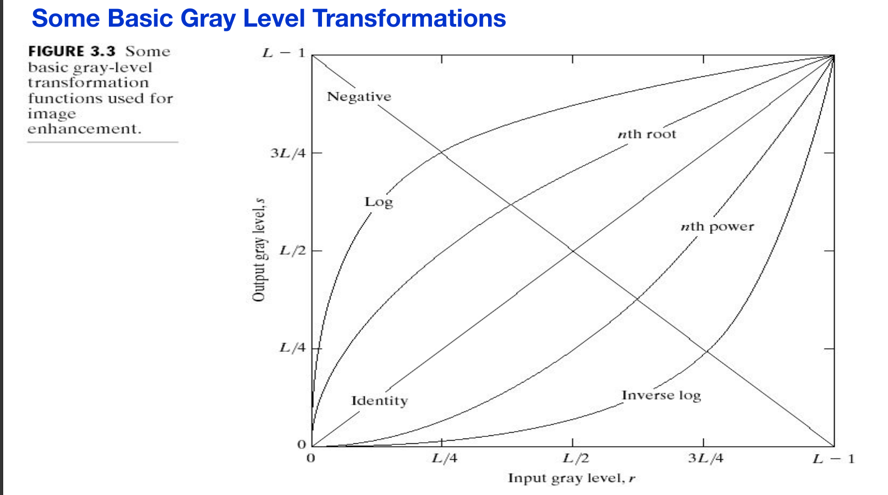

**Identity Transformation:**
* The mathematical expression is $s=r$, where $r$ is the pre-processing gray-level and $s$ is the post-processing gray-level.
* Output intensities are completely identical to the input intensities.
* Because it doesn't actually affect the image, it is typically only included in graphs for the sake of completeness.

**Negative Transformation:**

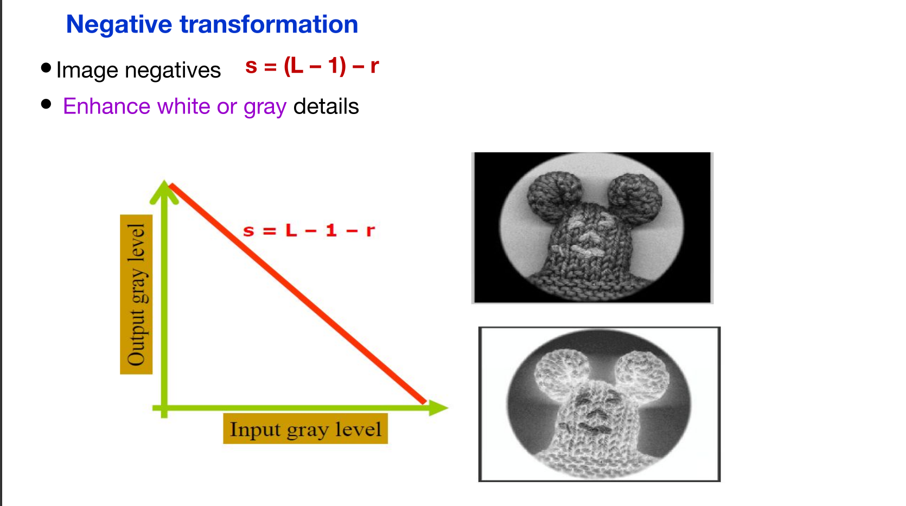

* For a gray-level range of $[0, L-1]$, the expression is $s=(L-1)-r$.
* This function reverses the image's intensity levels, yielding an equivalent photographic negative.
* It is highly effective for enhancing white and gray details embedded within dark regions, especially in images dominated by black areas.

---

### 4. Logarithmic Functions

**Log Transformation:**
* The expression is $s=c \log(1+r)$, where $c$ is a constant and $r \ge 0$.
* It maps a narrow range of low (dark) input gray-level values to a wider range in the output image.
* It is used to expand dark pixels while simultaneously compressing higher-level pixel values.
* It helps obtain the negative of an image within the $[0, L-1]$ range.
* It is highly useful for compressing the dynamic range of images with extreme variations in pixel values.
    * *Example:* It can compress an extremely large input range (e.g., 0 to $1.5 \times 10^6$) down to a range of 0 to 6.2, which easily fits within an 8-bit display limit (0 to 7).

**Inverse-Log Transformation:**
* This is the exact opposite of the log transformation.
* It expands high (bright) pixel values while compressing darker-level values.

---

### 5. Power-Law Transformations & Gamma Correction

**Power-Law Transformation:**
* The expression is $s=cr^\gamma$, where $c$ and $\gamma$ (gamma) are positive constants.
* If $c=1$ and $\gamma=1$, the function simply becomes $s=r$, which is the identity transformation.
* Curves utilizing fractional $\gamma$ values map narrow, dark input ranges into wider output ranges, with the opposite effect for higher input gray levels.
* Varying $\gamma$ produces different responses and transformation curves.
* Power-law functions are more versatile for spreading or compressing gray levels than log functions, though log functions retain the advantage of compressing dynamic ranges.

**Gamma Correction:**
* Many devices (such as image capture, printing, and display hardware) respond naturally according to a power law.
* Gamma correction is the specific process used to correct this power-law response phenomenon.
    * *Example:* CRT monitors have an intensity-to-voltage response that functions as a power law, causing outputs to appear darker than inputs. Gamma correction is mandatory in these cases.
* Proper correction is vital for displaying images accurately on computer screens; uncorrected images may look overly bleached or too dark.
* This concept is also used in color phenomena, general-purpose contrast manipulation, and is increasingly popular for formatting images on the internet.

**Gamma Value Rules:**
* **If $\gamma > 1$:** The mapping weights toward darker output values (black image).
* **If $\gamma < 1$:** The mapping weights toward brighter output values (white image).
* **If $\gamma = 1$:** The mapping is linear (default).

Here are the detailed college notes on Piece-wise Linear Transformation Functions, based on the provided document:

## **Piece-wise Linear Transformation Functions**

### **1. Overview of Piece-wise Linear Functions**
Piece-wise linear functions are a category of intensity transformation used in image processing.

* **Advantages:**
    * They can be formulated to be arbitrarily complex.
    * The practical implementation of certain critical transformations can *only* be achieved using piece-wise functions.
* **Disadvantages:**
    * Their specification demands considerably more user input compared to basic linear transformations.

---

### **2. Contrast Stretching: The Simplest Piece-wise Function**
Contrast stretching is considered the simplest form of a piece-wise linear transformation function.

* **Purpose:** The primary idea behind contrast stretching is to increase the dynamic range of the gray levels within an image.
* **Causes of Low Contrast:** Images may suffer from low contrast due to various factors during image acquisition, such as:
    * Lack of illumination.
    * Problems with the imaging sensor.
    * Incorrect settings of the lens aperture.

### **3. Mechanics of Contrast Stretching**
The shape of the contrast stretching curve is controlled by the location of specific points, denoted as $(r1, s1)$ and $(r2, s2)$.

* **Linear/No Change:** If $r1 = r2$ and $s1 = s2$, the transformation is a simple linear function that results in no change to the image's gray levels.
* **Thresholding:** If $r1 = s1$, $s1 = 0$, and $s2 = L - 1$, the transformation acts as a thresholding function, which converts the image into a binary image.
* **Contrast Adjustment:** Intermediate values for $(r1, s1)$ and $(r2, s2)$ create varying degrees of spread in the output image's gray values, which directly affects its contrast.
* **Order Preservation:** Generally, it is required that $r1 \le r2$ and $s1 \le s2$. This ensures the function remains single-valued and monotonically increasing. This condition is crucial because it preserves the order of gray levels, preventing the creation of unwanted intensity artifacts in the processed image.

### **4. How Contrast Stretching Improves Images**
Contrast stretching is a straightforward image enhancement technique that improves contrast by "stretching" the existing range of intensity values to span a new, desired range.

Given an original image $f$ (with pixels $r$) and a processed image $g$ (with pixels $s$), applying a specific transformation function $T(r)$ produces higher contrast by:
1.  **Darkening** the intensity levels that fall below a specific point $m$ in the original image.
2.  **Brightening** the intensity levels that fall above that point $m$ in the original image.

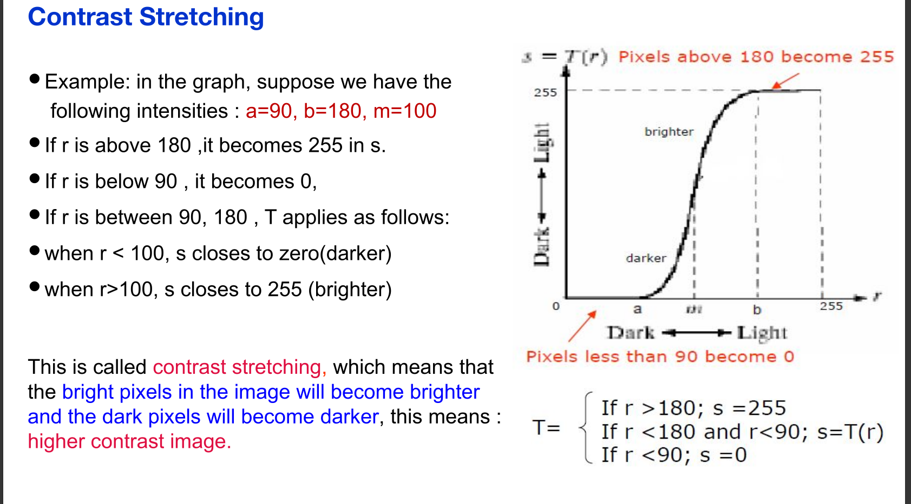

**Example Scenario:**
Assume a function with the following parameters: $a = 90$ (minimum threshold), $b = 180$ (maximum threshold), and $m = 100$ (midpoint). The transformation $T$ applies as follows:
* If the input intensity $r$ is greater than 180, the output $s$ becomes 255.
* If the input intensity $r$ is less than 90, the output $s$ becomes 0.
* If the input intensity $r$ falls between 90 and 180:
    * When $r < 100$, $s$ closes toward zero (becomes darker).
    * When $r > 100$, $s$ closes toward 255 (becomes brighter).
* **Result:** Bright pixels become brighter, and dark pixels become darker, resulting in a higher contrast image.

### **5. Mathematical Representation**
A common mathematical form for this specific type of contrast stretching function is:

$$s=T(r)=\frac{1}{1+(m/r)^{E}}$$

* **Variables:**
    * $r$: Represents the intensities of the input image.
    * $s$: Represents the corresponding intensity values in the output image.
    * $E$: A variable that controls the slope of the transformation function.


## Gray Level Histograms


### 1. Introduction to Histograms

* **In statistics:** A histogram is a graphical representation that provides a visual impression of the distribution of data.
* **An Image Histogram:** Specifically acts as a graphical representation of the lightness or color distribution within a digital image.
* It functions by plotting the number of pixels corresponding to each intensity value.
* Image histograms provide a global description of the image's overall appearance.
* Ultimately, the histogram represents the relative frequency of occurrence of various gray levels within the image.

> **Important Property:** Different images can possess the exact same histogram. For instance, multiple images where exactly half the pixels are white and half are gray will share the same statistics and thus the same histogram. Therefore, it is impossible to reconstruct an original image relying solely on its histogram.

---

### 2. Plotting Methods

Histograms can generally be plotted using two methods:

**Method 1: Pixel Count**

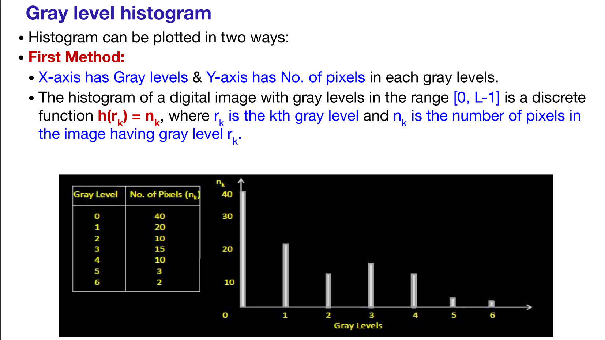

* The X-axis represents the Gray levels, and the Y-axis represents the total number of pixels at each gray level.
* For a digital image with gray levels in the range $[0, L-1]$, the histogram is a discrete function denoted as $h(r_k) = n_k$.
* In this function, $r_k$ is the $k$th gray level, and $n_k$ represents the number of pixels in the image that have that specific gray level $r_k$.

**Method 2: Normalized Histogram**
* It is common practice to normalize a histogram.
* The X-axis represents the gray levels, and the Y-axis represents the probability of occurrence of those gray levels.
* The probability function is $P(r_k) = n_k / n$, where $r_k$ is the gray level, $n_k$ is the number of pixels in that level, and $n$ is the total number of pixels in the entire image.
* The sum of all components in a normalized histogram will always equal 1.
* **Advantage:** The primary advantage of this method is that the maximum value plotted on the Y-axis will always be 1.

---

### 3. Types of Histograms based on Image Appearance

The shape of a histogram correlates directly with the visual appearance of the image:

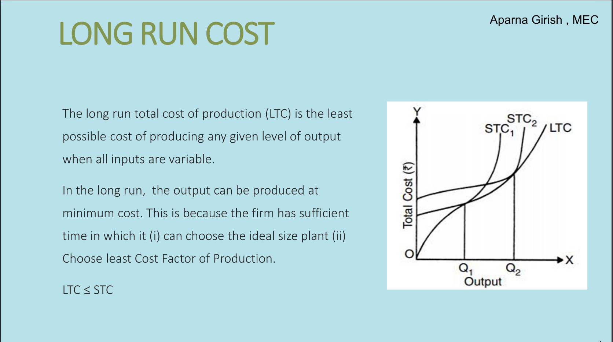

* **Dark Image:** The components of the histogram are heavily concentrated on the low (dark) side of the gray scale.
* **Bright Image:** The components of the histogram are biased toward the high (bright) side of the gray scale.
* **Low Contrast Image:** The histogram will appear narrow and clustered primarily toward the middle of the gray scale.
* **High Contrast Image:** The components cover a broad range of the gray scale. Furthermore, the distribution of pixels is relatively uniform, lacking large vertical spikes. This means pixels occupy the entire range of possible gray levels, resulting in a large variety of gray tones and the best visual appearance.

---

## Histogram Processing

The aim of histogram processing is to transform histograms of dark, bright, or low-contrast images into a high-contrast format (increasing the dynamic range). The document covers two primary methods: Histogram Stretching and Histogram Equalization.

### 1. Histogram Stretching

* This process improves image contrast by increasing the image's dynamic range.
* The basic shape of the original histogram is not modified; instead, the entire range of existing histogram values is simply stretched out.
* Before applying the process, upper and lower limits for the normalized pixel range must be specified (e.g., limits are typically between 0 and 255 for an 8-bit image).

**Formula:** $$S = \frac{S_{max} - S_{min}}{r_{max} - r_{min}} \times (r - r_{min}) + S_{min}$$

* $S_{max}$ = maximum limit value of the target image.
* $S_{min}$ = minimum limit value of the target image.
* $r_{max}$ = highest actual pixel value currently in the image.
* $r_{min}$ = lowest actual pixel value currently in the image.

### 2. Histogram Equalization

* Equalization attempts to spread out the gray levels in an image so they are evenly distributed across the entire possible range.
* It works by reassigning the brightness values of pixels based on the original image histogram.
* The primary goal is to make the histogram of the resultant image as flat as mathematically possible.
* This technique generally yields visually pleasing results across a wide variety of images.

**Steps to Perform Histogram Equalization:**

1. **Calculate CFD:** Find the running sum of the original histogram values, also known as the Cumulative Frequency Distribution (CFD).
2. **Normalize:** Normalize the running sum values obtained in Step 1 by dividing each by the total number of pixels in the image.
3. **Multiply & Round:** Multiply the normalized values from Step 2 by the maximum possible gray level value of the system, and round the result to the closest integer.
4. **Map Values:** Map the original gray level values to the new rounded results from Step 3 utilizing a one-to-one correspondence.


## Introduction to Edge Detection

* **Definition:** Edge detection is an image processing technique used to find the boundaries of objects within images. It operates by detecting discontinuities in brightness.
* **What is an Edge:** Edges are defined as sudden changes, discontinuities, or significant local transitions of intensity in an image.
* **Applications:** It is widely used for data extraction and image segmentation in fields such as computer vision and image processing.

---

## Classification of Edges

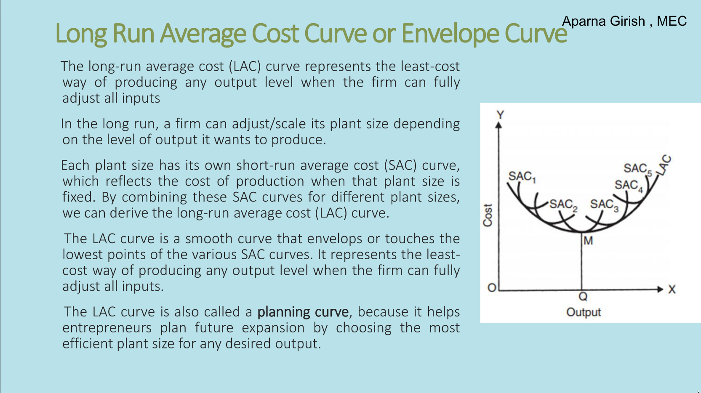

* **By Shape:** Edges can be classified into Step edges, Ramp edges, Ridge edges, and Roof edges.
* **By Direction:** The three general types of edges are Horizontal, Vertical, and Diagonal edges.

---

## Gradient-Based Edge Detection

* **Usage:** This method is best used for detecting abrupt discontinuities and performs better in images with less noise.
* **Properties:** The strength of the edge is determined by the magnitude of the gradient, while the direction of the gradient points in the opposite direction of the edge.
* **Formulas:** * **Magnitude:** $$|G|=\sqrt{Gx^{2}+Gy^{2}}\approx|Gx|+|Gy|$$
    * **Direction:** $$\theta=\tan^{-1}\left(\frac{Gy}{Gx}\right)$$

---

## Derivative Masks and Edge Detection Methods

Changes in an image can only be calculated using differentiation, which is why edge detection operators are often called derivative operators or derivative masks.

**General Properties of Derivative Masks:**
* Opposite signs must be present within the mask.
* The sum of the mask's values should equal zero.
* Applying more weight to the mask results in more prominent edge detection.

### 1. Prewitt Operator

* **Overview:** Detects both horizontal and vertical edges by calculating the difference between corresponding pixel intensities.
* **Vertical Mask:** * **Values:** $[-1, 0, 1]$, $[-1, 0, 1]$, $[-1, 0, 1]$.
    * The central column consists of zeros, so it excludes the original image values and strictly calculates the difference between the left and right pixel values around an edge region.
    * Convolving this mask highlights vertical edges because the zeros align vertically.
* **Horizontal Mask:** * **Values:** $[-1, -1, -1]$, $[0, 0, 0]$, $[1, 1, 1]$.
    * The central row consists of zeros, meaning it computes the difference between the above and below pixel intensities of a particular edge.
    * This highlights horizontal edges by increasing the visibility of sudden intensity changes.

### 2. Sobel Operator

* **Overview:** Very similar to the Prewitt operator, the Sobel operator also calculates differences between corresponding pixel intensities to find horizontal and vertical edges.
* **Key Distinction:** The coefficients of a Sobel mask are not fixed; they can be adjusted to give more weight to pixel values around the edge, provided they don't violate derivative mask properties. Because it allocates more weight to surrounding intensities, the Sobel operator generally makes edges more visible compared to the Prewitt operator.
* **Vertical Mask:** * **Values:** $[-1, 0, 1]$, $[-2, 0, 2]$, $[-1, 0, 1]$.
    * It operates like a first-order derivative, highlighting vertical edges by calculating right and left pixel differences.
* **Horizontal Mask:** * **Values:** $[-1, -2, -1]$, $[0, 0, 0]$, $[1, 2, 1]$.
    * Highlights horizontal edges by computing above and below pixel differences.
* **Weighted Variations:** Applying more weight directly reveals more edges. For example, changing the center row values to $-5$ and $5$ (e.g., $[-1, 0, 1]$, $[-5, 0, 5]$, $[-1, 0, 1]$) yields a stronger edge output.

### 3. Roberts Cross Operator

* **Overview:** The Roberts operator provides a simple and fast method for computing edges based on adjacent pixel differences. It approximates the image gradient via discrete differentiation.
* **Methodology:** It computes the sum of the squares of the differences between diagonally adjacent pixels. $+1$ and $-1$ are explicitly used to find forward differences.
* **Ideal Properties:** According to Roberts, a good edge detector should produce well-defined edges, minimize background noise, and have an edge intensity that closely aligns with human perception.
* **Mathematical Approach:**  Roberts proposed equations where $x$ is the initial intensity and $z$ is the computed derivative.
    $$y_{i,j}=\sqrt{x_{i,j}}$$
$$z_{i,j}=\sqrt{(y_{i,j}-y_{i+1,j+1})^{2}+(y_{i+1,j}-y_{i,j+1})^{2}}$$

* **Masks:** Uses $2\times2$ masks that highlight intensity changes in a diagonal direction.
    * **Mask $M_x$:** $[1, 0]$, $[0, -1]$ 
    * **Mask $M_v$:** $[0, 1]$, $[-1, 0]$ 
    * One mask is simply a 90-degree rotation of the other, allowing the operator to use diagonal directions for the gradient vector calculation.
* **Gradient Computation:** Let $G_{x}(x,y)$ and $G_{y}(x,y)$ be points formed by convolving with the first and second kernels.
    * **Gradient Definition:** $$\nabla I(x,y)=G(x,y)=\sqrt{G_{x}^{2}+G_{y}^{2}}$$
    * **Gradient Direction:** $$\Theta(x,y)=\arctan\left(\frac{G_{y}(x,y)}{G_{x}(x,y)}\right)-\frac{3\pi}{4}$$


## Neighborhood Processing in the Spatial Domain

* Neighborhood processing involves modifying a single pixel by considering the values of its immediate neighboring pixels.
* Common neighborhood mask sizes used for this purpose are 3x3, 5x5, or 7x7.
* A standard 3x3 neighborhood around a center pixel $f(x,y)$ is laid out as follows:
    * **Top row:** $f(x-1,y-1)$, $f(x-1,y)$, $f(x-1,y+1)$ 
    * **Middle row:** $f(x,y-1)$, $f(x,y)$, $f(x,y+1)$ 
    * **Bottom row:** $f(x+1,y-1)$, $f(x+1,y)$, $f(x+1,y+1)$ 

---

## Smoothing / Low Pass Filters

* **Definition:** Low pass filtering is also referred to as smoothing or smoothing linear filters.
* **Purpose:** These filters remove or eliminate high-frequency content from an image. Practically, they are used to blur an image.
* **Mechanism:** This operation is typically performed by averaging the pixel values within a mask, which can be either weighted or non-weighted.

**Non-weighted Average Filter:** A standard 3x3 low pass (smoothing) mask consists of equal weights distributed across the neighborhood:

```math
H = \frac{1}{9}\begin{pmatrix}1 & 1 & 1\\ 1 & 1 & 1\\ 1 & 1 & 1\end{pmatrix}
```

**Weighted Average Filters:** Weighted 3x3 masks place higher mathematical importance on the center pixel and its closest neighbors:

```math
H = \frac{1}{10}\begin{pmatrix}1 & 1 & 1\\ 1 & 2 & 1\\ 1 & 1 & 1\end{pmatrix}
```

```math
H = \frac{1}{16}\begin{pmatrix}1 & 2 & 1\\ 2 & 4 & 2\\ 1 & 2 & 1\end{pmatrix}
```

---

## High Pass & High Boost Filtering

* **Purpose:** High pass filtering eliminates low-frequency regions while retaining or enhancing the high-frequency components of an image.
* **Computation:** A high pass filtered image can be calculated by subtracting a low pass filtered version of the image from the original image.
    * $\text{High pass} = \text{Original} - \text{Low pass}$ 

**Standard Mask:** A standard 3x3 high pass filtering mask uses a positive center weight surrounded by negative weights:

```math
\begin{bmatrix}
-1/9 & -1/9 & -1/9 \\
-1/9 & 8/9 & -1/9 \\
-1/9 & -1/9 & -1/9
\end{bmatrix}
```

**High Boost Filtering:** By multiplying the original image by an amplification factor ($A$), you yield a high boost or high frequency-emphasis filter. The derivations are:
* $\text{Highboost} = A(\text{Original}) - \text{Lowpass}$ 
* $\text{Highboost} = (A-1)(\text{Original}) + \text{Original} - \text{Lowpass}$ 
* $\text{Highboost} = (A-1)(\text{Original}) + \text{Highpass}$ 

---

## Median Filtering

* **Definition:** Median filtering is classified as a type of nonlinear filtering.
* **Purpose:** It is used specifically to eliminate salt and pepper noise from an image.
* **Mechanism:** Rather than calculating an average, the target pixel's value is replaced by the median value of all the neighboring pixels within the mask.

## Spatial Convolution and Correlation


### 1. Introduction to Spatial Filtering

* **Filtering Definition:** Filtering involves accepting (passing) or rejecting specific frequency components within an image, which effectively smoothens or sharpens it.
* **Filter Types:** Common examples include lowpass filters and highpass filters.
* **Linear vs. Nonlinear:** A spatial filter is considered linear if the operations performed on the image pixels are linear; otherwise, it is classified as a nonlinear spatial filter.

**Classification by Effect**
Spatial filters are generally classified into two main categories based on their effect:
* **Smoothing Spatial Filters (Lowpass Filters):** Includes averaging linear filters and order-statistics nonlinear filters.
* **Sharpening Spatial Filters (Highpass Filters):** Includes Laplacian linear filters.

---

### 2. Smoothing Spatial Filters

Smoothing filters are primarily used for blurring and noise reduction.
* **Blurring Applications:** Used in preprocessing steps to remove small details from an image before extracting large objects, and to bridge small gaps in lines or curves.
* **Noise Reduction:** Can be achieved by blurring the image using either a linear or nonlinear filter.

**Averaging Linear Filters**
* **Mechanism:** The response is calculated simply as the average of the pixels contained within the neighborhood defined by the filter mask.
* **Output:** Produces a smoothed image with reduced "sharp" transitions in gray levels. Since both noise and edges consist of sharp transitions, these filters successfully reduce noise but come with the undesirable side effect of blurring edges.
* **Effects observed:**
    * Blurring increases as the mask size increases.
    * Small objects blend into or are removed from the background; the mask size dictates the relative size of the objects that get blended.
    * Produces a black border due to the padding of the original image's borders, leading to overall reduced image quality.

**Weighted Average Filter**
* **Concept:** Uses different coefficients to assign more importance (weight) to specific pixels over others.
* **Purpose:** The primary goal is to reduce the amount of blurring that occurs during the smoothing process.
* **Mathematical Expression:** Filtering an image $f$ of size $M\times N$ with a mask is given by the expression:
$$g(x,y)=\frac{\sum_{t=x}^{n}\sum_{t=t}^{b}w(s,t)f(x+s,y+t)}{\sum_{t=0}^{b}\sum_{t=0}^{b}w(s,t)}$$
To generate the complete filtered image, this equation is applied for $x=0,1,2,..., M-1$ and $y=0,1,2,...,N-1$.

---

### 3. The Process of Linear Spatial Filtering (Convolution)

* Linear spatial filtering (convolution) consists of moving a filter mask from pixel to pixel across an image.
* At any given pixel $(x,y)$, the filter's response is the sum of the products of the filter coefficients and the corresponding image pixels within the area covered by the mask.
* **Example for a $3\times3$ mask:**
$$R=w(-1,-1)f(x-1,y-1)+w(-1,0)f(x-1,y)+\cdot\cdot\cdot+w(0,0)f(x,y)+\cdot\cdot\cdot+w(1,0)f(x+1,y)+w(1,1)f(x+1,y+1)$$
* **General Formula:** For an image $f$ of size $M\times N$ and a filter mask of size $m\times n$:
$$g(x,y)=\sum_{s=-a}^{a}\sum_{t=-b}^{b}w(s,t)f(x+s,y+t)$$
Where $a=(m-1)/2$ and $b=(n-1)/2$. This must be applied for $x=0,1,2,... M-1$ and $y=0,1,2,..., N-1$.

---

### 4. Nonlinear Spatial Filtering

* Like linear filters, this operation involves moving the filter mask from pixel to pixel.
* However, the filtering operation is conditionally based on the values of the pixels within the neighborhood, rather than explicitly using coefficients in a sum-of-products manner.

**Order-Statistics Filters**
These are nonlinear spatial filters whose response is based on ordering (or ranking) the pixels in a neighborhood and replacing the center pixel's value with the result of that ranking.
* **Median Filter:** Replaces the center value with the median pixel value in the sorted neighborhood. It computes a nonlinear operation that is highly effective for noise reduction, resulting in less blurring than averaging linear filters.
    * **Application:** Particularly useful for removing impulse noise, also known as salt-and-pepper noise (where salt $=255$ and pepper $=0$ gray levels).
    * In a $3\times3$ neighborhood, the median is the 5th largest value, while in a $5\times5$ neighborhood, it is the 13th largest value.
* **Max Filter:** Used to find the brightest points in an image, given by $R=max\{z|k=1,2,...,9\}$.
* **Min Filter:** Used to find the dimmest points in an image, given by $R=min\{z|k=1,2,...,9\}$.

---

### 5. Sharpening Spatial Filters

* **Purpose:** Aims to highlight fine details, such as edges, or enhance details that have become blurred due to errors or imperfect capturing devices.
* **Concept:** Because averaging (integration) achieves blurring, sharpening is achieved by using spatial operators that invert the averaging process, namely partial derivatives.

**Partial Derivatives of Digital Functions**

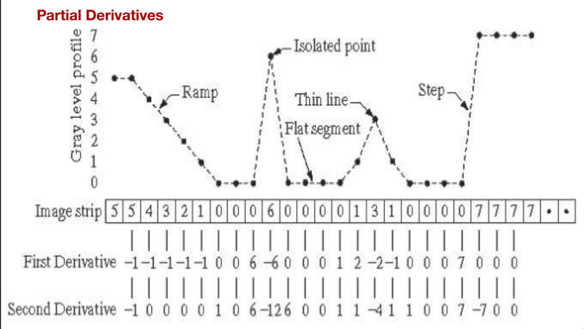

**First-Order Partial Derivatives:**
$$\frac{\partial f}{\partial x}=f(x+1,y)-f(x,y) \quad \text{and} \quad \frac{\partial f}{\partial y}=f(x,y+1)-f(x,y)$$
* **Properties:** Zero along flat segments, non-zero at the outset of a gray-level step or ramp (edges/noise), and non-zero along segments of continuing changes (ramps).
* **Effect:** Detects thick edges.

 **Second-Order Partial Derivatives:**
$$\frac{\partial^{2}f}{\partial x^{2}}=f(x+1,y)+f(x-1,y)-2f(x,y)$$
$$\frac{\partial^{2}f}{\partial y^{2}}=f(x,y+1)+f(x,y-1)-2f(x,y)$$

* **Properties:** Zero along flat segments, nonzero at both the outset and end of a gray-level step or ramp, and zero along ramps that have a constant slope.
* **Effect:** Detects thin edges and yields a much stronger response at a gray-level step than the first derivative. A second-order derivative enhances fine details, thin lines, and noise much more effectively than a first-order derivative.

---

### 6. The Laplacian Filter

The Laplacian is a linear spatial filter implemented using the convolution process.
* **Operator Equation:**
$$\nabla^{2}f=\frac{\partial^{2}f}{\partial x^{2}}+\frac{\partial^{2}f}{\partial y^{2}}$$

* **Mask Implementation:** This equation is commonly implemented using the following $3\times3$ mask:
```math
\begin{bmatrix}
-1 & -1 & -1 \\
-1 & 8 & -1 \\
-1 & -1 & -1
\end{bmatrix}
```

* **Visual Output:** Applying this operation produces a Laplacian image with grayish edge lines and discontinuities superimposed on a dark, featureless background.
* **Image Recovery:** Background features can be recovered while maintaining the sharpening effect by adding the original image to the Laplacian image:
$$g(x,y)=f(x,y)+\nabla^{2}f(x,y)$$

* **Disadvantage:** The main drawback of the Laplacian operator is that it produces double edges.

## Spatial Convolution and Correlation


### 1. Introduction to Linear Spatial Filtering

Correlation and convolution are two closely related fundamental concepts used in linear spatial filtering.

* **Purpose:** Both operations are utilized to extract meaningful information from images. By convolving an image with specific filters, it can be either smoothed (using a low pass filter) or sharpened (using a high pass filter).
* **Applications:** These techniques are widely applied in image filtering, image segmentation, and feature extraction.
* **Core Properties:** Both are fundamentally linear and shift-invariant operations.
    * **Linear:** This term indicates that an output pixel is replaced by a linear combination (weighted average) of its neighboring pixels.
    * **Shift Invariant:** This means that the exact same operation is performed at every single point across the entire image.

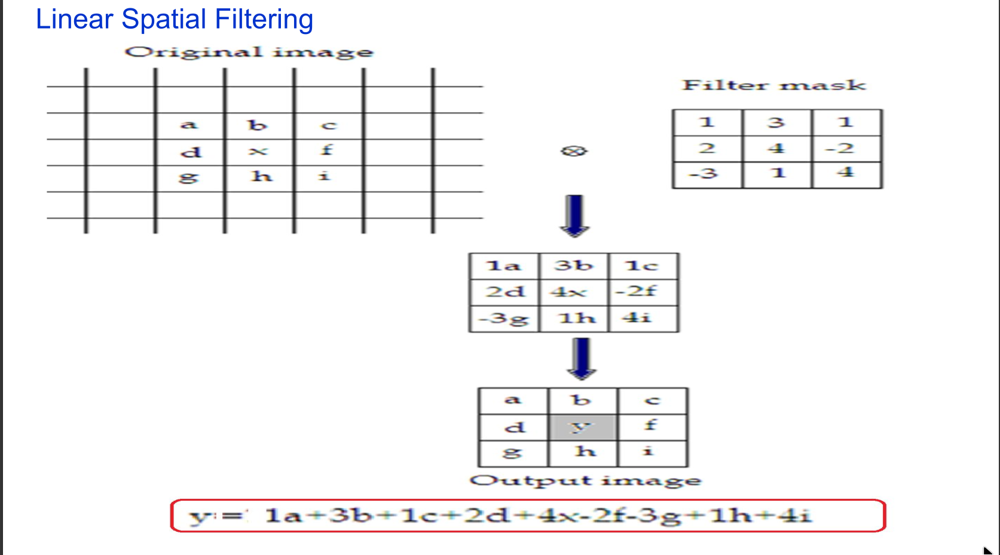

---

### 2. Core Definitions: Correlation vs. Convolution


There is only one mechanical difference between these two operations:

* **Correlation:** This is the process of moving (or passing) a filter mask over an image and computing the sum of the products at each location.
* **Convolution:** The mechanics are the exact same as correlation, with one critical exception: the filter mask must first be rotated by 180° before passing it over the image.

---

### 3. The Mathematical Mechanism

For linear spatial filtering, the output response is calculated as the sum of the products of the filter coefficients and the corresponding image pixels located in the area directly spanned by the filter mask.
For an image function $f(x,y)$ and a filter mask $w(s,t)$ of size $(2a+1) \times (2b+1)$, the mathematical expression for the response $g(x,y)$ at any point is:

$$g(x,y)=\sum_{s=-a}^{a}\sum_{t=-b}^{b}w(s,t)f(x+s,y+t)$$

**Example of a 3x3 Mask Calculation:**
If you have a 3x3 image section with pixels labeled a through i and a corresponding filter mask, the central output pixel y is calculated by multiplying each spatial position together and summing them:
* **Image pixels:** a, b, c, d, x, f, g, h, i 
* **Filter weights:** 1, 3, 1, 2, 4, -2, -3, 1, 4 
* **Output Equation:** $y = 1a + 3b + 1c + 2d + 4x - 2f - 3g + 1h + 4i$ 

---

### 4. Step-by-Step 1D Process (Exercise Walkthrough)

When calculating convolution and correlation, standard steps like "zero padding" and shifting are used.

**Given Data:**
* **Input Array F:** {0, 0, 2, 0, 0} 
* **Filter Mask (Kernel):** {7, 5, 1} 

**Part A: 1D Convolution**
1. **Rotate the Mask:** Because this is convolution, the kernel must be rotated 180°. The mask {7, 5, 1} becomes {1, 5, 7}.
2. **Zero Padding:** Add zeros to the ends of the input array so the mask can slide over the edges.
3. **Shift and Multiply:** Slide the rotated template bit by bit, calculating the sum of products for the center pixel:
    * **Initial shifts:** When the mask overlaps only with padded zeros, the output is 0.
    * **Shift 3:** The mask aligns such that $(1 \times 0) + (5 \times 0) + (7 \times 2) = 14$. The output is 14.
    * **Shift 4:** The mask aligns such that $(1 \times 0) + (5 \times 2) + (7 \times 0) = 10$. The output is 10.
    * **Shift 5:** $(1 \times 2) + (5 \times 0) + (7 \times 0) = 2$. The output is 2.
    * **Final shifts:** Once the mask passes the non-zero data, the output returns to 0, and the process stops when the range is crossed.

**Part B: 1D Correlation**
1. **Do Not Rotate the Mask:** The mask remains {7, 5, 1}.
2. **Shift and Multiply:**
    * **Initial shifts:** Produce an output of 0.
    * **Shift 3:** Results in an output of 2.
    * **Shift 4:** Results in an output of 10.
    * **Shift 5:** Results in an output of 14.
3. **Final Array:** The resulting 'full' correlation output sequence is [0, 0, 2, 10, 14, 0, 0].

*Note: Depending on how the output boundaries are handled in software, results are often cropped to a 'same' result matching the original input size, or kept as a 'full' result including the padded edges.*


## Detailed Notes: Image Segmentation


### 1. Introduction to Image Segmentation

* **The primary aim** of image segmentation is to partition an image into a collection or set of pixels.
* This partitioning helps identify meaningful regions (coherent objects), linear structures (such as lines and curves), and specific shapes (like circles and ellipses).
* Segmentation divides an image into regions that are connected, sharing some similarity within the region while exhibiting differences from adjacent regions.
* The ultimate goal is usually to find and isolate individual objects within an image.

**Key Applications:**
* Content-based image retrieval.
* Machine Vision and Video surveillance.
* Medical Imaging applications (e.g., tumor delineation).
* Object detection and recognition (e.g., face detection, face recognition, fingerprint recognition).
* 3D Reconstruction and Object/Motion Tracking.
* Object-based measurements, evaluating metrics such as size and shape.

---

### 2. Feature Extraction

Segmentation serves as an approach for Feature Extraction in an image.

* **Features of an Image:** These include points, lines, edges, corner points, and regions.
* **Geometrical attributes:** Characteristics such as orientation, length, curvature, area, diameter, and perimeter.
* **Topological attributes:** Relationships such as overlap, adjacency, common end points, parallel lines, and vertical alignment.

---

### 3. Approaches to Image Segmentation

There are fundamentally two main approaches to segmentation: Discontinuity and Similarity.

**A. Similarity-Based Approach**
* This approach is based on detecting similarities between image pixels to form a segment, often relying on a threshold.
* Similarities can be based on pixel intensity, color, texture, histogram data, or other features.
* Machine Learning algorithms, such as clustering, frequently utilize this approach to segment images.
* **Techniques include:** Thresholding, Region Growing, and Region splitting & merging.

**B. Discontinuity-Based Approach**
* This approach relies on identifying sudden changes (discontinuities) in pixel intensity values across the image.
* These sudden changes in intensity along a boundary line form what is known as an "edge".
* **Techniques include:** Isolated Points, Lines, and Edges.

*(Note: Line, Point, and Edge Detection techniques provide intermediate segmentation results that are later processed to yield the final segmented image.)*

---

### 4. Detection of Discontinuities

There are three primary kinds of intensity discontinuities: points, lines, and edges.
The most common method for detecting these discontinuities is scanning a small mask (or filter) over the image. The specific mask used determines the type of discontinuity being searched for.

**Point Detection**
Point detection uses a specific mask and evaluates it against a nonnegative threshold, denoted as $T$. The condition for a point is defined as $|R| \ge T$.

* **Point Detection Mask:** Center is weighted at 8, with all surrounding pixels weighted at -1.
```math
\begin{bmatrix} -1 & -1 & -1 \\ -1 & 8 & -1 \\ -1 & -1 & -1 \end{bmatrix}
```

**Line Detection**
Line detection looks for a one-pixel-wide line in an image and is slightly more common than point detection. For digital images, straight lines spanning three points can only be horizontal, vertical, or diagonal ($+45^\circ$ or $-45^\circ$).

* **Horizontal Mask:** 
```math
\begin{bmatrix} -1 & -1 & -1 \\ 2 & 2 & 2 \\ -1 & -1 & -1 \end{bmatrix}
```

* **Vertical Mask:** 
```math
\begin{bmatrix} -1 & 2 & -1 \\ -1 & 2 & -1 \\ -1 & 2 & -1 \end{bmatrix}
```

* **$+45^\circ$ Diagonal Mask:** 
```math
\begin{bmatrix} -1 & -1 & 2 \\ -1 & 2 & -1 \\ 2 & -1 & -1 \end{bmatrix}
```

* **$-45^\circ$ Diagonal Mask:** 
```math
\begin{bmatrix} 2 & -1 & -1 \\ -1 & 2 & -1 \\ -1 & -1 & 2 \end{bmatrix}
```

---

### 5. Edge Detection & Gradient Operators

Edge detection utilizes the gradient to determine both the strength and direction of an edge at a specific point. Crucially, the physical edge in the image is perpendicular to the direction of the gradient vector at the point where the gradient is computed. 

The gradient image can be approximated using the components in the x and y directions: $\nabla f \approx |G_x| + |G_y|$.

**Common Gradient Operators (Masks)**

**1. Roberts Operator:** 
```math
\begin{bmatrix} -1 & 0 \\ 0 & 1 \end{bmatrix} \quad \text{and} \quad \begin{bmatrix} 0 & -1 \\ 1 & 0 \end{bmatrix}
```

**2. Prewitt Operator:** 
```math
\begin{bmatrix} -1 & -1 & -1 \\ 0 & 0 & 0 \\ 1 & 1 & 1 \end{bmatrix} \quad \text{and} \quad \begin{bmatrix} -1 & 0 & 1 \\ -1 & 0 & 1 \\ -1 & 0 & 1 \end{bmatrix}
```

**3. Sobel Operator:** 
```math
\begin{bmatrix} -1 & -2 & -1 \\ 0 & 0 & 0 \\ 1 & 2 & 1 \end{bmatrix} \quad \text{and} \quad \begin{bmatrix} -1 & 0 & 1 \\ -2 & 0 & 2 \\ -1 & 0 & 1 \end{bmatrix}
```

**Masks for Detecting Diagonal Edges**
Both Prewitt and Sobel have specific variations for detecting diagonal edges.

* **Prewitt Diagonal Masks:** 
```math
\begin{bmatrix} 0 & 1 & 1 \\ -1 & 0 & 1 \\ -1 & -1 & 0 \end{bmatrix} \quad \text{and} \quad \begin{bmatrix} -1 & -1 & 0 \\ -1 & 0 & 1 \\ 0 & 1 & 1 \end{bmatrix}
```

* **Sobel Diagonal Masks:** 
```math
\begin{bmatrix} 0 & 1 & 2 \\ -1 & 0 & 1 \\ -2 & -1 & 0 \end{bmatrix} \quad \text{and} \quad \begin{bmatrix} -2 & -1 & 0 \\ -1 & 0 & 1 \\ 0 & 1 & 2 \end{bmatrix}
```


## College Notes: Image Segmentation Techniques

Image segmentation is a fundamental process in digital image processing. The primary techniques used for image segmentation include:
* Threshold Based Segmentation
* Edge Based Segmentation
* Region-Based Segmentation
* Clustering Based Segmentation
* Artificial Neural Network Based Segmentation

---

### 1. Threshold Based Segmentation

Image thresholding is a simple form of image segmentation. It operates by setting a specific threshold value based on the pixel intensity of the original image to create a binary or multi-color image.

**The Thresholding Process:**
1. First, the process considers the intensity histogram of all the pixels present in the image.
2. Next, a threshold is set to divide the image into distinct sections.
3. For example, in an image with pixel values ranging from 0 to 255, a threshold of 60 might be set.
4. Pixels with values less than or equal to 60 are assigned a value of 0 (representing black).
5. Pixels with a value greater than 60 are assigned a value of 255 (representing white).

**Fundamental Assumptions:**
* Intensity values differ across different regions of an image.
* Within a specific region representing an object, the intensity values are similar to one another.
* The range of intensity levels covered by the objects of interest differs significantly from the background.

**Mathematical Representation:**
A standard single threshold ($T$) operation separates pixels into two groups:
$$g(x,y)=\begin{cases}1 & \text{if } f(x,y)>T\\ 0 & \text{if } f(x,y)\le T\end{cases}$$
Images can also utilize multiple thresholds, such as $T_{1}$ and $T_{2}$, for more complex segmentation.

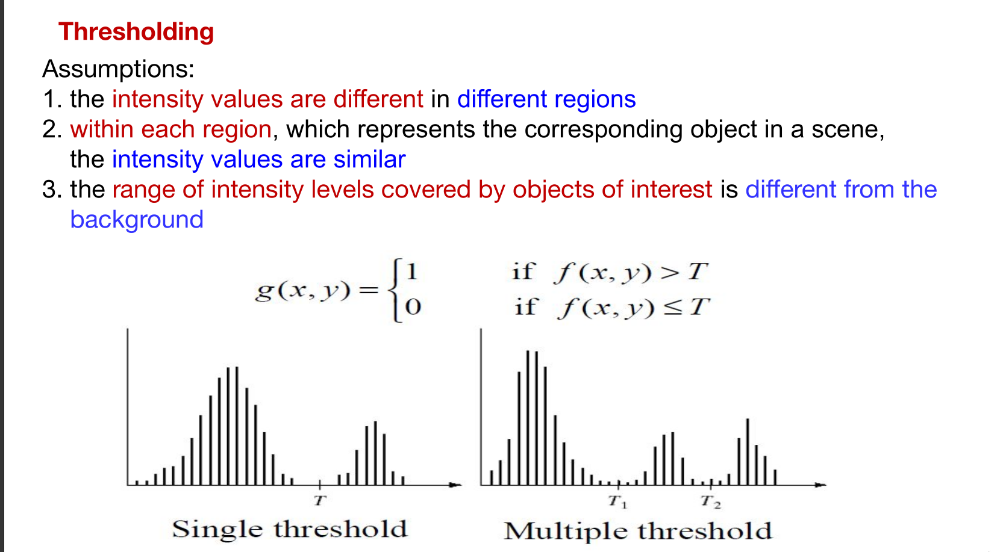

---

### 2. Types of Thresholding

* **Global or Fixed Thresholding:** A constant threshold value is selected and held constant throughout the entire image. This threshold value depends entirely on the pixel intensities $f(x,y)$.
* **Dynamic, Adaptive, or Local Thresholding:** The threshold depends on both the pixel value $f(x,y)$ and its spatial coordinates/pixel position $p(x,y)$. Because of this, the threshold will vary for different pixels across the image. To achieve this, the image is divided into overlapping sections, which are then thresholded one by one.
* **Optimal Thresholding:** This method involves estimating the incorporated error if a particular threshold is chosen. The goal is to choose a threshold value that minimizes the average error.

---

### 3. Histogram Analysis and Intensity Thresholding

Image binarization frequently uses a single global threshold $T$ to map a scalar image into a binary image. This is commonly achieved through histogram analysis of intensity levels. Optimization strategies aim to create large, connected regions while minimizing small-sized artifacts.

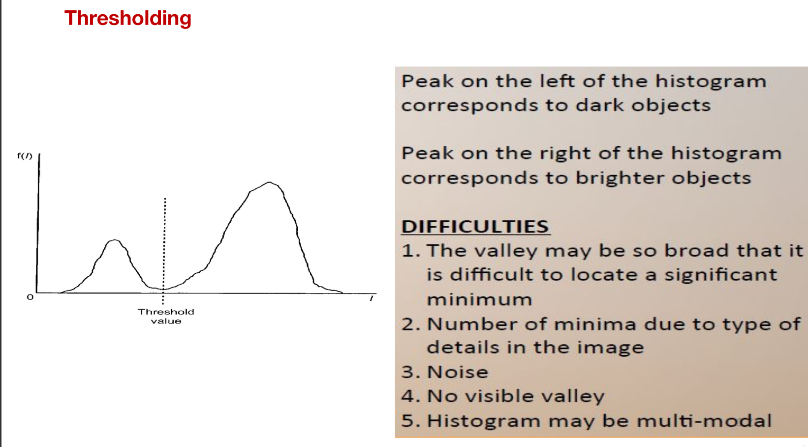

* In a typical histogram, the peak on the left corresponds to darker objects or the background.
* The peak on the right corresponds to brighter objects.
* The threshold ($T$) is usually placed in the "valley" between these two peaks.
    * **Background (Darker):** $f(x,y)\le T$.
    * **Object (Brighter):** $f(x,y)>T$.

**Difficulties Encountered in Thresholding:**
* The valley between histogram peaks may be too broad, making it difficult to pinpoint a significant minimum.
* Specific image details can create multiple minima.
* Interference from image noise.
* There may be no visible valley at all.
* The overall histogram may be multi-modal (containing many peaks).

---

### 4. Advantages and Disadvantages of Thresholding

**Advantages:**
* It is very simple to implement.
* The process is extremely fast, especially when repeated on similar images.
* It is highly effective for specific types of images, such as scanned documents or scenes with controlled lighting.

**Disadvantages:**
* It provides no guarantees of object coherency.
* The resulting image may contain holes or extraneous pixels.
* It often requires an incomplete solution like post-processing using morphological operators to clean up the segmented image.

---

### 5. Logical Image Operations

Logical operations are frequently used alongside segmentation techniques to combine or isolate specific regions of interest (represented as sets A and B).

| Operation | Description |
| :--- | :--- |
| **NOT (A)** | Output pixels represent elements not in A. All elements in A become zero, and all other pixels become 1. |
| **A AND B** | The output represents the set of coordinates common to both A and B. |
| **A OR B** | The output pixels belong to either A, or B, or both. |
| **A AND (NOT B)** | Output pixels belong to A, but are explicitly not in B. |
| **A XOR B** | Exclusive OR. The output pixels belong to either A or B, but not to both. |


## Region-Based Segmentation in Image Processing


### Introduction to Region-Based Segmentation

* **Motivation:** Traditional segmentation methods based on edges and thresholds sometimes fail to produce good results.
* **Core Concept:** Region-based segmentation works on the principle of connecting similar pixels to form a coherent region.

**What is a Region?**
* It is a group of connected pixels that share similar properties.
* It has closed boundaries.
* Regions are computed based on similarity and spatial proximity.
* They typically correspond to objects in a scene or distinct parts of those objects.

* **Key Rule:** Every region must be uniform, making the connectivity of pixels within the region extremely important.
* **Main Approaches:** The two primary methods for this type of segmentation are region growing and region splitting.

---

### Criteria for Complete Segmentation

For an image to be completely and correctly segmented, it must satisfy five critical criteria:
1. All pixels must be assigned to regions.
2. Each pixel must belong to only a single region.
3. Each region must be a connected set of pixels.
4. Each individual region must be uniform in its properties.
5. If any two adjacent regions are merged, the resulting new region must be non-uniform.

**Mathematical Formulation**
Let $R$ represent the entire image area. Segmentation is the process of partitioning $R$ into $n$ subregions, $R_1, R_2, ..., R_n$, such that:

* **(a)** $\bigcup_{i=1}^{n}R_{i}=R$ (The union of all subregions equals the whole image) 
* **(b)** $R_i$ is a connected region, where $i=1,2,...,n$ 
* **(c)** $R_i \cap R_j = \phi$ for all $i$ and $j$, where $i \ne j$ (Regions are mutually exclusive and do not overlap) 
* **(d)** $P(R_i) = \text{TRUE}$ for $i=1,2,...,n$ (The logical predicate or homogeneity condition holds true for each individual region) 
* **(e)** $P(R_i \cup R_j) = \text{FALSE}$ for any adjacent regions $R_i$ and $R_j$ (Adjacent regions cannot be merged and still satisfy the uniformity predicate) 

*(Note: $P(R_k)$ is a logical predicate defined over the points in set $R_k$, evaluating to TRUE if, for example, all pixels in $R_k$ share the same graylevel).*

---

### Region Growing Algorithms

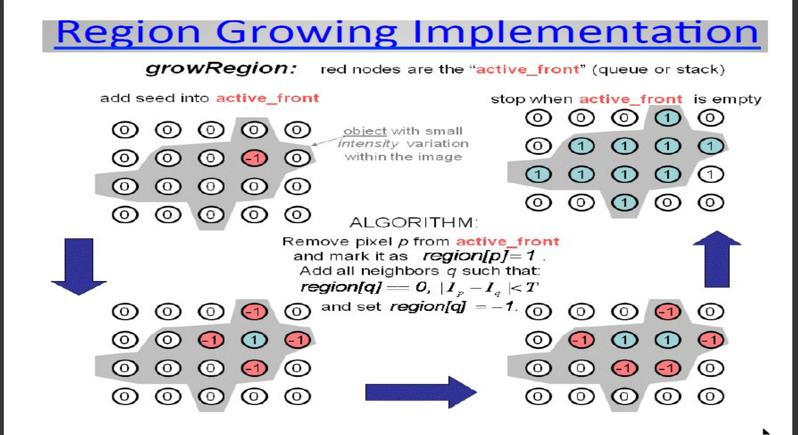

Region growing algorithms operate on the principle of similarity, assuming a region is coherent if all its pixels are homogeneous. This homogeneity can be based on color, intensity, texture, or other statistical properties.

**How it Works**
* **Seed Selection:** The algorithm begins by picking a pixel inside a region of interest (ROI) to act as a starting point, known as a "seed point". Seeds can be provided by the user or chosen automatically, and there can be single or multiple seeds.
* **Growing Process:** The seed point is compared with its neighboring pixels. If the neighbor's properties match the seed's properties (based on a similarity criterion), they are added to the region.
* **Iteration & Termination:** This process is repeated for newly added pixels. The algorithm terminates when the regions converge, meaning no further merging is possible.

**Homogeneity Criteria & Segmentation Dependency**
Examples of criteria used to determine if a region $R$ is homogeneous include:

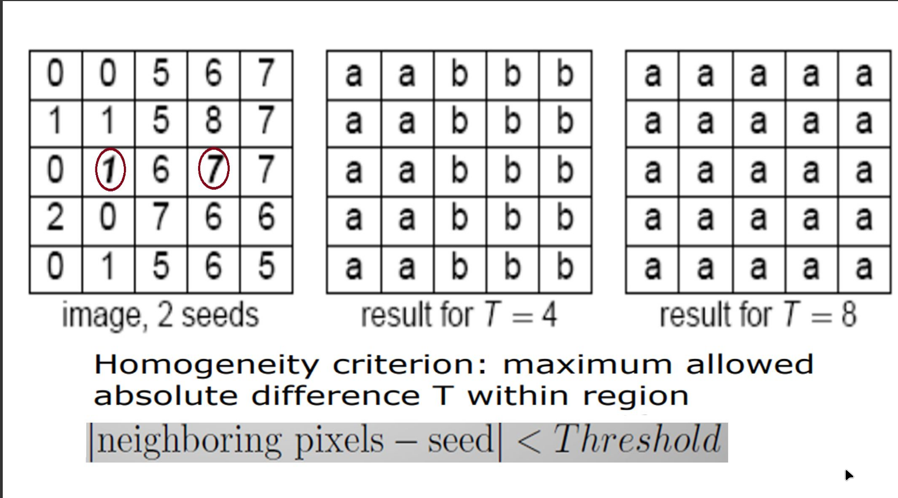

* The difference between the maximum and minimum grey-values in $R$ is small.
* The difference between any pixel and the mean grey-value in $R$ is small, or the variance of grey-values is small.
* A common absolute difference threshold: $\text{neighboring pixels} - \text{seed} < \text{Threshold}$.

The overall success of the segmentation depends heavily on the properties used, how similarity is measured, and the specific tolerance or threshold applied.

**Pros and Cons of Region Growing**
* **Advantages:** Generally performs better on noisy images where borders and edges are difficult to detect, making it superior to standard thresholding for certain defects.
* **Drawbacks:** The output can easily become either over-segmented (producing too many small regions) or under-segmented (producing too few large regions). Furthermore, it cannot identify objects that span multiple disconnected regions.

---

### Region Merging

Region merging approaches the problem from the opposite direction.
* **Starting Point:** It begins with an over-segmented image (an image broken down into too many tiny regions).
* **Process:** A specific criterion is defined for merging two adjacent regions. The algorithm proceeds to merge all adjacent regions that satisfy this merging criterion.
* **Termination:** The process stops when no two adjacent regions can be merged any further.

---

### Region Split and Merge Algorithm

To combat the slowness of basic region growing, the Split and Merge algorithm combines subdivision and agglomeration. It uses a region (or a node in a Regional Adjacency Graph) as a starting point rather than a single pixel.

**The Splitting Phase**
* Region splitting is the direct opposite of region growing.
* It starts with a large region, which could be the entire image itself.
* A measurement (predicate) is used to test if this region is uniform.
* If the region is non-uniform, it is split into two or more subregions.
* Each resulting region is independently tested again.
* This subdivision continues recursively until all resulting regions meet the uniform predicate criteria.

**The Quadtree Data Structure**

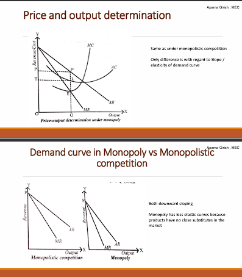
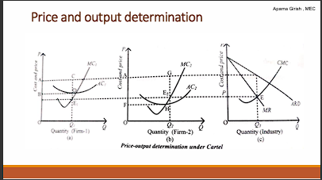

* A common method to manage the splitting process is using a Quadtree—a tree data structure where each parent node has exactly four descendant nodes.
* If the image fails the homogeneity test, it is split into four equal disjoint quadrants.
* The test is applied recursively to each quadrant until the stopping criteria are fulfilled (usually when all regions are homogeneous or regions become too small to divide).

**Complete Split and Merge Algorithm Steps**
1. **START:** Consider the entire image as one single region.
2. **Evaluate:** If the region satisfies the homogeneity criteria ($P(R_i) = \text{TRUE}$), leave it unmodified.
3. **Split:** If it does not satisfy the criteria ($P(R_i) = \text{FALSE}$), split it into four disjoint quadrants and recursively apply the evaluation step to each newly generated quadrant. Stop splitting when all regions in the quadtree satisfy the criterion.
4. **Merge:** Once splitting is complete, look at adjacent regions. If any adjacent regions $R_i$ and $R_j$ can be combined to form a homogeneous region ($P(R_i \cup R_j) = \text{TRUE}$), merge them. Note that this merging step may destroy the strict quadtree structure.
5. **STOP:** The algorithm terminates entirely when no further splitting or merging operations are possible.
